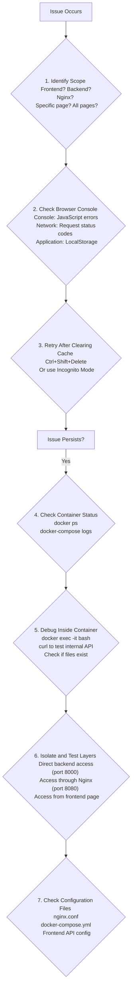

<div align="right"> <a href="/posts/fronted-backend_integrated_deploy"><strong>English</strong></a> | <a href="/posts/前后端集成部署">简体中文</a> </div>

## Integrated Deployment Simulation

### Simulating Raspberry Pi on a PC

​	By using Docker Compose on a PC to fully simulate all services on a Raspberry Pi (Nginx + FastAPI + Astro static files), we can discover and fix numerous configuration issues (e.g., incorrect Nginx proxy paths, CORS policy problems) before deployment, significantly increasing the success rate.

### Core Concept: Orchestrating a "Mini-Internet" with Docker Compose

​	On a PC, a single docker-compose.yml file defines and starts three interconnected services to simulate a real deployment scenario:

1. **Nginx Service (Web Server/Reverse Proxy)**:
   The sole gatekeeper. All requests from the browser are first sent to it. It is responsible for directly serving static content (the Astro website) and forwarding API requests (/api/...) to the backend.
2. **Backend Service (FastAPI Application)**:
   It hides behind Nginx and never communicates directly with the outside world. It only receives API requests forwarded from Nginx and executes business logic (manipulating Markdown files).
3. **Astro's Build Artifacts (dist/ directory)**:
   This is not a "service" but a "data volume" used by the Nginx service.

​	Docker Compose creates an isolated internal network for these services, allowing them to communicate with each other via service names (e.g., http://backend:8000).

### TODO: Building the Local Simulation Environment

#### Step 1: Adjusting Project Structure for Centralized Management

To facilitate management with Docker Compose, all configuration files are placed in the project root directory.

```
/webTest/
├── backend/
│   ├── app/
│   ├── Dockerfile
│   └──docker-compose.yml <-- Backend's docker config, unrelated to parent dir
├── yukina/
│   ├── src/
│   └── ... (Astro project)
│
├── nginx/                     <-- Nginx configuration folder
│   ├── nginx.conf             # Nginx configuration file
│   └── Dockerfile             # Dockerfile to build the Nginx image
│
└── docker-compose.yml         <-- The single, main orchestration file
  
```

#### Step 2: Creating the Nginx Configuration Files

1. Create an nginx folder in the project root directory.
2. Inside the nginx/ folder, create nginx.conf. This file is the soul of the simulation environment.
3. Inside the nginx/ folder, create a Dockerfile. This file is very simple, its only purpose is to copy our configuration file into the official Nginx image.

```dockerfile
# nginx/Dockerfile

# Use the official Nginx image
FROM nginx:stable-alpine

# Remove the default Nginx configuration
RUN rm /etc/nginx/conf.d/default.conf

# Copy our custom configuration file into the container
COPY nginx.conf /etc/nginx/conf.d/
  
```

#### Step 3: Writing the Main docker-compose.yml

Create the docker-compose.yml file in the **project root directory** (/webTest/).

```yml
    version: '3.8'

services:
  # Backend FastAPI Service
  backend:
    # Specify the build context and Dockerfile location
    build:
      context: ./backend
      dockerfile: Dockerfile
    container_name: sim_backend
    # Volume mounts:
    # - Mount code to support hot-reloading (for dev validation only)
    # - Mount data directory to persist the SQLite database
    # - Crucial: Mount the frontend content directory so the backend can manipulate Markdown files
    volumes:
      - ./backend/app:/code/app
      - ./backend/data:/code/data
      - ./fronted/src/contents:/code/fronted/src/contents # Path may need adjustment
    # Note: Port mapping is no longer needed as it is not directly exposed

  # Frontend Nginx Service
  nginx:
    build:
      context: ./nginx
      dockerfile: Dockerfile
    container_name: sim_nginx
    # Port mapping: Map the PC's port 8080 to the container's port 80
    ports:
      - "8080:80"
    # Volume mounts:
    # - Mount the built Astro dist directory from the PC to Nginx's web root
    volumes:
      - ./yukina/dist:/usr/share/nginx/html
    # Dependency: Ensure the backend service starts before Nginx
    depends_on:
      - backend
  
```

**Note:**
	In the backend service's volumes, a line must be added to mount the frontend's content directory, so FastAPI can find and modify the Markdown files. The path reference to this directory in the FastAPI code must also be configured correctly.

#### Step 4: Executing the Full Simulation Workflow

Now, you can start the simulation.

1. **Build the Frontend**:
   - First, you must build the static site.
   - cd into the frontend directory and run pnpm run build.
   - Ensure the frontend/dist/ folder has been generated.
2. **Start the Entire Simulation Environment**:
   - Return to the project **root directory** (/webTest/).
   - Run the command: docker-compose up --build
   - Docker Compose will:
     - Build images for both backend and nginx.
     - Create an internal network.
     - Start the backend container first, then the nginx container, according to depends_on.
     - Mount all defined volumes.
3. **Verify the Simulation Results**:
   - **Verify Frontend**: Open a browser and navigate to http://localhost:8080 (note the 8080 port). You should see your Astro blog's homepage. Click links and browse pages to confirm the site is working.
   - **Verify Backend API Docs**: Navigate to http://localhost:8080/docs. This request will be caught by Nginx and forwarded to the backend service. If you see the FastAPI Swagger UI, the reverse proxy is **successful**.
4. **Perform End-to-End Testing**:
   1. Visit the admin login page (e.g., http://localhost/admin/login).
   2. Attempt to log in. The request will travel through Nginx -> backend.
   3. After a successful login, try to create, edit, or delete a post.
   4. **Crucial Verification**: After saving a post, the backend's trigger_astro_rebuild() function will be called. **In the simulation environment, this step will fail** because the container typically lacks a Node.js environment. **This is expected!** The main purpose of the simulation is to verify **API connectivity and Nginx configuration**.
   5. You can manually stop the service (Ctrl+C), re-run step 1 (pnpm run build), restart the service (docker-compose up), and then refresh the browser. You should see the new or modified post.

​	This process provides an environment on your PC with a **network architecture identical** to the one on the Raspberry Pi, allowing for confident development and testing.

### Summary

The current state is the perfect transition point from **"verifying network connectivity"** to **"achieving a fully automated workflow."**

The primary purpose of the previous simulation was to prove that:

1. The browser can talk to Nginx.
2. Nginx can correctly serve static files.
3. Nginx can correctly forward API requests to FastAPI.

This objective has been **successfully achieved**. Now, we need to make this environment **truly usable** by resolving that expected failure.

------


## Integrated Deployment Environment Development Summary - Bug Fix Report

### I. Project Background and Goals

#### 1.1 Project Overview

This project aims to simulate a Raspberry Pi 4B production environment on a PC using Docker Compose to build a complete blog system integration and deployment architecture. The system uses a three-tier architecture:

- **Nginx**: Reverse proxy server, responsible for serving static files and forwarding API requests.
- **FastAPI Backend**: Backend API service, handling CRUD operations for blog posts.
- **Astro Frontend**: Static site generator, providing the frontend pages and admin panel.

#### 1.2 Deployment Goals

1. Achieve containerized deployment with Docker.
2. Verify the correctness of the Nginx reverse proxy configuration.
3. Test the full CRUD functionality of the admin panel.
4. Ensure proper communication between frontend and backend through Nginx.

### II. Docker Build Context Issue

#### 2.1 Problem Description

**Error Message:**

```bash
failed to calculate checksum of ref: "/yukina/package.json": not found
```

**Root Cause:**

- Initial configuration set the docker-compose.yml build context to ./backend.
- The backend/Dockerfile attempted to access a parent directory with COPY ../yukina/package.json.
- Docker build context limitation: Files outside the context directory cannot be accessed.

**Code Example (Incorrect Configuration):**

```dockerfile
# backend/Dockerfile
COPY ../yukina/package.json /code/yukina/package.json  # ❌ Cannot access parent directory
```

#### 2.2 Solution: Dual Dockerfile Architecture

Adopted **Solution 2: A Separation of Concerns Architecture**.

**Architecture Design**:

```bash
/webTest/
├── backend/
│   ├── app/
│   ├── Dockerfile          # Simplified version: Python + Node.js env only
│   ├── docker-compose.yml  # For standalone backend development
│   └── requirements.txt
├── yukina/                 # Frontend project
│   ├── package.json
│   └── pnpm-lock.yaml
├── nginx/
│   ├── Dockerfile
│   └── nginx.conf
├── backend.Dockerfile      # Complete version: Includes all dependencies
└── docker-compose.yml      # For integrated deployment (in root)
  
```

**Key Configuration Changes:**

1. **Root docker-compose.yml**

   ```bash
   services:
     backend:
       build:
         context: .              # ✅ Changed build context to the root directory
         dockerfile: backend.Dockerfile
       container_name: sim_backend
       command: uvicorn app.main:app --host 0.0.0.0 --port 8000 --reload
     
   ```

2. **backend.Dockerfile (Complete Version)**

   ```dockerfile
   FROM python:3.11-slim-bookworm
   
   # Install system dependencies
   RUN apt-get update && apt-get install -y curl git && rm -rf /var/lib/apt/lists/*
   
   # Install Node.js and pnpm
   ENV NODE_VERSION=22
   RUN curl -fsSL https://deb.nodesource.com/setup_${NODE_VERSION}.x | bash - \
       && apt-get install -y nodejs
   RUN npm config set registry https://registry.npmmirror.com && npm install -g pnpm
   
   WORKDIR /code
   
   # Copy backend dependencies
   COPY backend/requirements.txt /code/requirements.txt
   RUN pip install --no-cache-dir --upgrade -r /code/requirements.txt
   
   # Copy backend code
   COPY backend/app /code/app
   
   RUN mkdir -p /code/yukina
   COPY yukina/package.json /code/yukina/package.json
   COPY yukina/pnpm-lock.yaml /code/yukina/pnpm-lock.yaml
   
   # Install frontend dependencies during the build
   RUN cd /code/yukina && pnpm install --frozen-lockfile
   
   EXPOSE 8000
   CMD ["uvicorn", "app.main:app", "--host", "0.0.0.0", "--port", "8000"]
     
   ```

3. **backend/Dockerfile (Simplified Version)**

   ```dockerfile
   FROM python:3.11-slim-bookworm
   
   # Only install Python and Node.js environment, do not handle pnpm dependencies
   RUN apt-get update && apt-get install -y curl git && rm -rf /var/lib/apt/lists/*
   
   ENV NODE_VERSION=22
   RUN curl -fsSL https://deb.nodesource.com/setup_${NODE_VERSION}.x | bash - \
       && apt-get install -y nodejs
   RUN npm config set registry https://registry.npmmirror.com && npm install -g pnpm
   
   WORKDIR /code
   RUN pip config set global.index-url https://pypi.tuna.tsinghua.edu.cn/simple
   
   COPY ./requirements.txt /code/requirements.txt
   RUN pip install --no-cache-dir --upgrade -r /code/requirements.txt
   
   COPY ./app /code/app
   
   # Create frontend project directory (dependencies mounted via volume, installed on startup)
   RUN mkdir -p /code/yukina
   
   EXPOSE 8000
   CMD ["uvicorn", "app.main:app", "--host", "0.0.0.0", "--port", "8000"]
     
   ```

#### 2.3 Advantages of the Solution

1. **Scenario Isolation**: Standalone development and integrated testing environments are completely separate.
2. **Clear Responsibilities**: The purpose of each Dockerfile is explicit.
3. **No Context Issues**: The complete Dockerfile's context is the root directory, allowing access to all files.
4. **Cache Utilization**: Frontend dependencies are installed during the build, leveraging Docker layer caching.

### III. Node.js Dependency Compatibility Issue

#### 3.1 Problem Description

Executing pnpm run build inside the container fails, with errors indicating node_modules not found or incompatible dependencies.

**Root Cause:**

- The docker-compose.yml file mounted the entire ./yukina directory.
- The node_modules from the Windows host (with binaries compiled for Windows) was mounted into the Linux container.
- The Linux container cannot use Windows-platform node_modules.

**Code Example (Problematic Configuration):**

```yml
volumes:
  - ./yukina:/code/yukina  # ❌ This will overwrite the container's Linux version of node_modules
```

#### 3.2 Solution: Anonymous Volume Protection

​	Use a Docker **Anonymous Volume** to protect the node_modules directory inside the container.

**Modified docker-compose.yml**:

```yml
services:
  backend:
    volumes:
      - ./backend/app:/code/app
      - ./backend/data:/code/data
      - ./yukina:/code/yukina              # Mount the frontend project
      - /code/yukina/node_modules          # Anonymous volume: prevents host from overwriting container's node_modules
    environment:
      - ASTRO_CONTENT_PATH=/code/yukina/src/contents/posts
      - ASTRO_PROJECT_PATH=/code/yukina
  
```

#### 3.3 Technical Principle

- Anonymous volumes have higher priority than bind mounts.
- When two volume mount paths have a parent-child relationship, the child path (the more specific one) takes precedence.
- The /code/yukina/node_modules anonymous volume will overwrite the node_modules part of the ./yukina:/code/yukina bind mount.

### IV. Frontend Hardcoded URL Issue

#### 4.1 Problem Description

​	Hardcoded http://localhost:8000 in the frontend JavaScript code caused API access failures in the integrated environment (which uses port 8080).

**Symptom:**

- Browser console: ERR_CONNECTION_REFUSED
- Reason: The frontend tried to directly access the backend's port 8000, which was not exposed to the host.

#### 4.2 Solution: Use Relative Paths

Modify the frontend code to use relative paths, ensuring all API requests are routed through the Nginx proxy.

**List of Files Modified:**

1. **apiClient.ts**

   ```ts
       class ApiClient {
     // ✅ Use an empty string, all requests will use relative paths
     private baseURL = import.meta.env.PUBLIC_API_URL || '';
   
     private async request<T = any>(endpoint: string, options: RequestInit = {}): Promise<T> {
       const url = `${this.baseURL}${endpoint}`;  // e.g., /api/admin/posts
       // ... request logic
     }
   }
     
   ```

2. **authService.ts**

   ```ts
   async login(credentials: LoginCredentials): Promise<boolean> {
     const response = await fetch('/token', {  // ✅ Relative path
       method: 'POST',
       body: formData,
     });
     // ...
   }
     
   ```

3. **yukina.config.ts**

   ```ts
   const YukinaConfig: Configuration = {
     site: process.env.SITE_URL || "http://localhost:8080",  // ✅ Support environment variables
     // ...
   };
     
   ```

#### 4.3 CORS Configuration

Add port 8080 to the backend's CORS whitelist:

```py
# backend/app/core/config.py
ALLOWED_ORIGINS: list[str] = (
    ["http://localhost:3000", "http://127.0.0.1:3000",
     "http://localhost:8080", "http://127.0.0.1:8080"] +  # ✅ Added 8080
    [f"http://localhost:{port}" for port in range(4321, 5001)] +
    [f"http://127.0.0.1:{port}" for port in range(4321, 5001)]
)
  
```

#### 4.4 Build and Deploy

After modifying the code, the frontend needs to be rebuilt:

```bash
cd yukina
pnpm install
pnpm run build
  
```

### V. Nginx Reverse Proxy Redirect Issue

#### 5.1 Problem Description

**Symptom:**

- Browser request: http://localhost:8080/api/admin/posts/ (with a trailing slash)
- Server response: 307 Temporary Redirect
- Redirect location: location: http://localhost/api/admin/posts (port 8080 is lost)
- Browser attempts to access: http://localhost:80/api/admin/posts → ERR_CONNECTION_REFUSED

**Root Cause Analysis:**

1. **FastAPI's Automatic Redirect Behavior**

   ```bash
   # Test direct access to backend
   $ docker exec sim_backend curl -i http://localhost:8000/api/admin/posts/
   HTTP/1.1 307 Temporary Redirect
   location: http://localhost:8000/api/admin/posts
     
   ```

   - FastAPI redirects URLs with a trailing slash to the non-slash version.

2. **Nginx Fails to Correct the location Header**

   - Backend returns: location: http://localhost:8000/api/admin/posts
   - After passing through the Nginx proxy, the browser receives: location: http://localhost/api/admin/posts
   - The port number is lost!

#### 5.2 Solution: Nginx Redirect Correction with Regular Expressions

**Initial Configuration (Ineffective):**

```nginx
location ~ ^/(api|docs|openapi\.json|token) {
    proxy_pass http://backend:8000;
    proxy_redirect off;  # ❌ Completely disables redirect correction
}
  
```

**Attempt 1 (Ineffective):**

```nginx
proxy_redirect http://backend:8000/ http://$host:$server_port/;
  
```

- $server_port is the internal container port (80), not the external mapped port (8080).

**Attempt 2 (Ineffective):**

```nginx
proxy_redirect http://backend:8000/ http://$host:8080/; 
```

**Final Solution (Effective): Use Regular Expressions**

```nginx
    location ~ ^/(api|docs|openapi\.json|token) {
    proxy_pass http://backend:8000;

    proxy_set_header Host $host;
    proxy_set_header X-Real-IP $remote_addr;
    proxy_set_header X-Forwarded-For $proxy_add_x_forwarded_for;
    proxy_set_header X-Forwarded-Proto $scheme;

    # ✅ Use a regular expression to capture the path and reconstruct the URL
    proxy_redirect ~^http://[^/]+(/.*)$ http://$host:8080$1;
}
  
```

**Regex Explanation:**

- ```nginx
  ~^http://[^/]+(/.*)$: Matches any HTTP URL and captures the path part.
    [^/]+: Matches the hostname and port (any characters except a slash).
    (/.*)$: Captures the full path (starting from the first slash).
  http://$host:8080$1: Reconstructs the correct URL.
    $host: The current hostname (localhost).
    8080: The external mapped port.
    $1: The captured path part.
  ```

**Verification Result:**

```bash
$ curl -i http://localhost:8080/api/admin/posts/
HTTP/1.1 307 Temporary Redirect
location: http://localhost:8080/api/admin/posts  # ✅ Port is correct
```

#### 5.3 Complete Nginx Configuration

```nginx
    # nginx/nginx.conf

server {
    listen 80;
    server_name localhost;

    # Disable absolute path redirects
    absolute_redirect off;
    # Prevent adding port number in redirects (to avoid port confusion)
    port_in_redirect off;

    root /usr/share/nginx/html;
    index index.html;

    # Static file routing
    location / {
        try_files $uri $uri/ /index.html;
    }

    # API reverse proxy
    location ~ ^/(api|docs|openapi\.json|token) {
        proxy_pass http://backend:8000;

        proxy_set_header Host $host;
        proxy_set_header X-Real-IP $remote_addr;
        proxy_set_header X-Forwarded-For $proxy_add_x_forwarded_for;
        proxy_set_header X-Forwarded-Proto $scheme;

        # Correct the redirect URL returned by the backend
        proxy_redirect ~^http://[^/]+(/.*)$ http://$host:8080$1;
    }
}
  
```

### VI. Frontend Slug Extraction Logic Error

#### 6.1 Problem Description

**Symptom:**

- Clicking the "Edit" button for any post opens the editor page.
- The page displays a blank form (like the "Create" page), but the button says "Update Post".
- Browser console error: Failed to load post: Failed to fetch.
- Network request shows: GET http://localhost:8080/api/admin/posts/ (with a trailing slash, no slug).
- Clicking the "Update Post" button results in a 405 Method Not Allowed error.

**Expected Behavior:**

- Should request: GET http://localhost:8080/api/admin/posts/Build-Environment-Test
- Load post data and populate the form.

#### 6.2 Root Cause Analysis

**URL Path Structure:**
Visited URL: http://localhost:8080/admin/editor/Build-Environment-Test/
↑ Trailing slash

**Original Code Logic:**

```js
// yukina/src/pages/admin/editor/[slug].astro (lines 172-174)

// ❌ Incorrect slug extraction logic
const pathSegments = window.location.pathname.split('/');
const slug = pathSegments[pathSegments.length - 1];
  
```

**Execution Analysis:**
window.location.pathname = "/admin/editor/Build-Environment-Test/"

pathSegments = pathname.split('/')
// Result: ['', 'admin', 'editor', 'Build-Environment-Test', '']
//                                                            ↑ Trailing empty string

slug = pathSegments[pathSegments.length - 1]
// Result: slug = '' (an empty string!)

**Problem Chain:**

1. Slug is extracted as an empty string.
2. postService.getPostBySlug('') is called.
3. API request is constructed: /api/admin/posts/${slug} → /api/admin/posts/.
4. FastAPI redirects /api/admin/posts/ to /api/admin/posts (the endpoint for getting all posts).
5. A list of posts is returned instead of a single post.
6. The frontend cannot parse the data and displays a blank form.
7. Submitting uses the PUT method on /api/admin/posts → 405 error (endpoint does not support PUT).

#### 6.3 Solution

**Fixed Code:**

```js
// yukina/src/pages/admin/editor/[slug].astro (lines 172-175)

// ✅ Correct slug extraction logic: filter out empty strings
const pathSegments = window.location.pathname.split('/').filter(s => s.length > 0);
const slug = pathSegments[pathSegments.length - 1];
  
```

**Execution Result:**
window.location.pathname = "/admin/editor/Build-Environment-Test/"

pathSegments = pathname.split('/').filter(s => s.length > 0)
// Result: ['admin', 'editor', 'Build-Environment-Test']
//        ↑ Empty strings have been filtered

slug = pathSegments[pathSegments.length - 1]
// Result: slug = 'Build-Environment-Test' ✅

**Verification Result:**

- API request: GET http://localhost:8080/api/admin/posts/Build-Environment-Test ✅
- Server response: 200 OK, containing full post data.
- Form is correctly populated with post content.
- Edit functionality works as expected.

#### 6.4 Rebuilding the Frontend

The frontend must be rebuilt after the code change:

```bash
# 1. Build the frontend locally
cd yukina
pnpm run build

# 2. The Nginx container will automatically use the new dist/ directory (via volume mount)
# docker-compose.yml configuration:
#   nginx:
#     volumes:
#       - ./yukina/dist:/usr/share/nginx/html

# 3. Clear browser cache and test
# Ctrl+Shift+Delete → Clear cached images and files
  
```

#### 6.5 Scope of Application

This issue affects all dynamic route pages with trailing slashes. The .filter() method should be used in similar URL handling scenarios:

```js
// ✅ Recommended pattern for handling dynamic route parameters
const segments = window.location.pathname.split('/').filter(s => s.length > 0);
const param = segments[segments.length - 1];

// Or use slice to exclude the first and last empty elements
const segments = window.location.pathname.split('/').slice(1, -1);
```

**Notes:**

- Astro-generated static routes often include index.html, and URLs may or may not have a trailing slash.
- The absolute_redirect off configuration ensures Nginx does not automatically add or remove slashes.
- Frontend code should be robust enough to handle both cases.

------


### VII. Browser Cache Interference Issue

#### 7.1 Problem Description

After multiple configuration fixes, the user still encountered old errors:

- Modified Nginx config and restarted containers, but the issue persisted.
- Modified frontend code and rebuilt, but it still requested the wrong URL.
- The browser displayed old response data.

#### 7.2 Root Cause

**HTTP Caching Mechanisms:**

1. **Static Asset Cache**: The browser caches JavaScript and CSS files.
2. **Redirect Cache**: The browser caches 301/307 redirect responses.
3. **Service Worker**: May cache API requests.

**Symptom:**

- The browser loaded an old version of a JavaScript file (containing the hardcoded URL).
- The browser remembered the incorrect redirect (http://localhost/api/admin/posts).
- Even after the server was fixed, the browser continued to use its cache.

#### 7.3 Solution

**Force Clear Browser Cache:**

**1. Chrome/Edge Clear Cache**

- Ctrl+Shift+Delete
- → Select "Cached images and files"
- → Select "Time range: All time"
- → Click "Clear data"

**2. Hard Reload**

- Ctrl+Shift+R (Windows/Linux)
- Cmd+Shift+R (Mac)

**3. Use Incognito/Private Mode for Testing**

- Ctrl+Shift+N (Chrome/Edge)
- Ctrl+Shift+P (Firefox)

**4. Disable Cache (Developer Tools)**

- F12 → Network tab → ✓ Disable cache

**Frontend Build Cache Cleanup:**

```bash
# Astro generates filenames with hashes, automatically handling caching
cd yukina
rm -rf dist/
pnpm run build
  
```

**Docker Container Cache Cleanup:**

```bash
# If you suspect caching issues within the container
docker-compose down
docker-compose up -d --build --force-recreate
  
```

#### 7.4 Preventive Measures

**During Development:**

1. Always keep "Disable cache" enabled in developer tools.
2. Clear browser cache after every significant configuration change.
3. Use incognito mode to verify fixes.

**In Production:**

1. Astro automatically generates filenames with content hashes for static assets.
   _astro/postService.BhPugt7n.js
   ↑ Content hash, updates automatically when content changes

2. Add appropriate cache headers in Nginx (optional).

   ```bash
   location /_astro/ {
     expires 1y;
     add_header Cache-Control "public, immutable";
   }
   
   location /api/ {
     add_header Cache-Control "no-cache, no-store, must-revalidate";
   }
     
   ```

------


### VIII. TypeScript Configuration Issue

#### 8.1 Problem Description

During local development, VS Code reports an error:
Cannot find file 'astro/tsconfigs/strict'.

#### 8.2 Root Cause

tsconfig.json configuration:

```json
{
  "extends": "astro/tsconfigs/strict",
  "include": [".astro/types.d.ts", "**/*"],
  "exclude": ["dist"]
} 
```

- The configuration extends astro/tsconfigs/strict.
- However, the Astro dependency is not found in the local node_modules.
- Possible reasons:
  a. node_modules was deleted or corrupted.
  b. Windows path length limit prevented some files from being installed.
  c. Permission issues.

#### 8.3 Solution

**Reinstall Dependencies:**

```bash
cd yukina

# If deletion fails (due to Windows path length limit)
# Use pnpm to force reinstall
pnpm install --force

# Or use the rimraf tool
npm install -g rimraf
rimraf node_modules
pnpm install
  
```

**Verify Installation:**

```bash
    # Check if Astro is installed correctly
ls yukina/node_modules/astro/tsconfigs/
# Should output: base.json  strict.json  strictest.json
  
```

**Reload VS Code:**

1. Press Ctrl+Shift+P
2. Type TypeScript: Restart TS Server
3. Press Enter

#### 8.4 Windows Path Length Issue

**Common Errors:**

- EACCES: permission denied, open 'D:\...\node_modules\...\package.json'
- Cannot remove item ...: Part of the path could not be found.

**Cause:**

- Windows has a default path length limit of 260 characters.
- Deeply nested node_modules can exceed this limit.

**Solutions:**

**1. Enable Long Path Support (Windows 10 1607+)**

```bash
# Run PowerShell as Administrator
New-ItemProperty -Path "HKLM:\SYSTEM\CurrentControlSet\Control\FileSystem" `
-Name "LongPathsEnabled" -Value 1 -PropertyType DWORD -Force
  
```

**2. Use pnpm's shamefully-hoist**

```bash
pnpm install --shamefully-hoist
```

- Hoists dependencies to the top level, reducing nesting depth.

**3. Move the Project to a Shorter Path**

- D:\Coding\Wrote_Codes\webTest\yukina\node_modules\...  # Long path
  ↓
- C:\webTest\yukina\node_modules\...  # Short path

------


### IX. Full Testing and Verification

#### 9.1 Environment Startup Procedure

```bash
# 1. Ensure the frontend is built
cd yukina
pnpm install
pnpm run build

# 2. Start the integrated environment
cd ..
docker-compose up -d --build

# 3. Check container status
docker ps
# Should display:
# - sim_backend (running)
# - sim_nginx (running)

# 4. Check logs (optional)
docker-compose logs -f backend
docker-compose logs -f nginx
  
```

#### 9.2 Functional Test Checklist

**Basic Functionality Test:**

- Access homepage: http://localhost:8080 → 200 OK
- Access post page: http://localhost:8080/posts/xxx → 200 OK
- Access API docs: http://localhost:8080/docs → Swagger UI displays correctly

**Admin Panel Test:**

1. **Login Functionality**
   - Visit: http://localhost:8080/admin/login
   - Enter username and password
   - Successful login redirects to Dashboard
2. **Post List (Read)**
   - Visit: http://localhost:8080/admin/dashboard
   - Displays a list of all posts
   - Network request: GET /api/admin/posts → 200 OK
3. **Edit Post (Update)**
   - Click "Edit" on any post
   - Redirects to the editor page, URL like: /admin/editor/xxx/
   - Network request: GET /api/admin/posts/xxx → 200 OK
   - Form is correctly populated with post data
   - Monaco editor displays post content
   - Click "Update Post" after modification
   - Network request: PUT /api/admin/posts/xxx → 200 OK
   - Redirects back to Dashboard on success
   - Backend executes pnpm run build to regenerate static files
4. **Create Post (Create)**
   - Click the "New Post" button
   - Fill out the form and content
   - Click "Create Post"
   - Network request: POST /api/admin/posts → 200 OK
   - Successfully creates and redirects
5. **Delete Post (Delete)**
   - Click the "Delete" button on a post
   - Confirm deletion
   - Network request: DELETE /api/admin/posts/xxx → 200 OK
   - Post is removed from the list

#### 9.3 Network Request Verification

Use browser developer tools:

1. Press F12 to open developer tools
2. Switch to the "Network" tab
3. Perform actions and observe network requests

**Correct Request Patterns:**

1. **Get All Posts**
   GET http://localhost:8080/api/admin/posts
   Status: 200 OK
2. **Get Single Post**
   GET http://localhost:8080/api/admin/posts/Build-Environment-Test
   Status: 200 OK
3. **Update Post**
   PUT http://localhost:8080/api/admin/posts/Build-Environment-Test
   Status: 200 OK
   Content-Type: application/json
4. **Create Post**
   POST http://localhost:8080/api/admin/posts
   Status: 200 OK
5. **Delete Post**
   DELETE http://localhost:8080/api/admin/posts/Build-Environment-Test
   Status: 200 OK

**Check Redirects (if any):**

```bash
# Request with trailing slash should be redirected correctly
GET http://localhost:8080/api/admin/posts/
Status: 307 Temporary Redirect
Location: http://localhost:8080/api/admin/posts  ✅ Port is correct

# Browser automatically follows the redirect
GET http://localhost:8080/api/admin/posts
Status: 200 OK
  
```

#### 9.4 Performance Observation

**Known Latency:**

- Editor page load time: ~10 seconds
- Reasons:
  a. Node.js module loading inside the container
  b. Markdown file reading and parsing
  c. Docker network communication latency

**Acceptable Range:**

- For an admin panel, a 10-second load time is acceptable.
- If optimization is needed, consider:
  - Adding backend caching
  - Optimizing file reading logic
  - Using a database instead of the file system

------


### X. Summary and Best Practices

#### 10.1 Issue Summary Table

| #    | Issue Type      | Description                       | Root Cause                   | Solution                           | Scope       |
| ---- | --------------- | --------------------------------- | ---------------------------- | ---------------------------------- | ----------- |
| 1    | Docker Build    | Cannot access parent dir files    | Build context limitation     | Dual Dockerfile architecture       | Build Stage |
| 2    | Dependency      | Windows node_modules incompatible | Platform differences         | Anonymous volume protection        | Runtime     |
| 3    | Frontend Config | Hardcoded localhost:8000          | Leftover dev config          | Relative paths + env vars          | API Request |
| 4    | Nginx Proxy     | Redirect loses port number        | FastAPI redirect + Nginx     | Regex proxy_redirect               | All API Req |
| 5    | Frontend Logic  | Incorrect slug extraction         | Did not filter empty strings | filter() method                    | Editor Page |
| 6    | Browser Cache   | Loading old version of files      | HTTP caching mechanism       | Clear cache                        | Dev/Test    |
| 7    | TypeScript      | Cannot find Astro config          | node_modules not installed   | Reinstall dependencies             | Dev Env     |
| 8    | Windows         | Path length limit                 | 260 character limit          | Enable long paths/shamefully-hoist | Local Dev   |

#### 10.2 Analysis of Technical Difficulties


**10.2.1 The Hardest Problem to Solve: Nginx Redirection：**

**Difficulty: ⭐⭐⭐⭐⭐**

**Challenges:**

1. **Hidden Problem**: The error occurred at the HTTP redirect layer, not in the application logic.
2. **Multi-layer Propagation**: FastAPI → Nginx → Browser, any layer could be the source.
3. **Complex Configuration**: Multiple proxy_redirect configurations were attempted without success.
4. **Scarce Documentation**: Documentation and examples for regex-based proxy_redirect are limited.

**Key to Solution:**

- Understanding FastAPI's automatic redirect behavior (trailing slash).
- Understanding Nginx proxy_redirect matching rules (requires exact match or regex).
- Using a regular expression to capture the path and dynamically reconstruct the URL.

**Lessons Learned:**

```nginx
# Incorrect: Assumes $server_port is the external port
proxy_redirect http://backend:8000/ http://$host:$server_port/;

# Incorrect: Trailing slash doesn't match a location without one
proxy_redirect http://localhost:8000/ http://$host:8080/;

# Correct: Use a regex to match any URL form
proxy_redirect ~^http://[^/]+(/.*)$ http://$host:8080$1;
  
```

------


**10.2.2 An easily overlooked issue: browser cache**：

**Difficulty: ⭐⭐⭐**

**Challenges:**

- Server configuration was modified, but the browser still exhibited old behavior.
- Easy to mistakenly believe the server configuration change was ineffective.
- Wasted significant time re-checking server configurations.

**Preventive Measures:**

1. Always enable "Disable cache" during development.
2. Clear browser cache after every major change.
3. Use incognito mode to verify fixes.
4. Observe the request source in the Network tab (from cache / from network).

------


**10.2.3 Platform Differences: Windows vs. Linux**：

**Difficulty: ⭐⭐⭐⭐**

**Challenges:**

- Environmental differences between a Windows host and a Linux container.
- Native Node.js modules (like sharp) are platform-dependent.
- Windows path length limitations.
- File permission issues.

**Solution Strategies:**

- Use Docker anonymous volumes to isolate platform-specific files.
- Install dependencies in the Dockerfile (during build) rather than on startup.
- Keep project paths as short as possible.
- Use pnpm instead of npm (better symlink handling).

#### 10.3 Best Practice Recommendations

**10.3.1 Docker Configuration**：

**1. Build Context Design**

```yml
# ✅ Recommended: Root directory as context, specify dockerfile
services:
  backend:
    build:
      context: .                    # Root directory
      dockerfile: backend.Dockerfile # Specify file

# ❌ Avoid: Subdirectory as context, accessing parent
services:
  backend:
    build:
      context: ./backend
      dockerfile: Dockerfile
    # Cannot COPY ../yukina/...
  
```

**2. Dependency Management Strategy**

```yml
# ✅ Recommended: Install dependencies during build
COPY package.json pnpm-lock.yaml ./
RUN pnpm install --frozen-lockfile

# ✅ Paired with anonymous volume protection
# ============================ in powershell
# docker-compose.yml
volumes:
  - ./app:/app
  - /app/node_modules  # Anonymous volume
  
```

**3. Multi-stage Builds (Optimization)**

```dockerfile
# Optional: If image size is a concern
FROM node:22-alpine AS frontend-builder
WORKDIR /build
COPY yukina/package.json yukina/pnpm-lock.yaml ./
RUN pnpm install
COPY yukina/ ./
RUN pnpm run build

FROM python:3.11-slim
WORKDIR /app
COPY --from=frontend-builder /build/dist /app/frontend
# ... remaining configuration
  
```


------

**10.3.2 Nginx Configuration**：

**1. Reverse Proxy Best Practices**

```nginx
    location /api/ {
    # Basic proxy
    proxy_pass http://backend:8000;

    # Essential headers
    proxy_set_header Host $host;
    proxy_set_header X-Real-IP $remote_addr;
    proxy_set_header X-Forwarded-For $proxy_add_x_forwarded_for;
    proxy_set_header X-Forwarded-Proto $scheme;

    # Correct redirects (as needed)
    proxy_redirect ~^http://[^/]+(/.*)$ http://$host:$server_port$1;

    # Timeout settings (for long operations)
    proxy_connect_timeout 60s;
    proxy_send_timeout 60s;
    proxy_read_timeout 60s;
}
  
```

**2. Static File Serving**

```nginx
    location / {
    root /usr/share/nginx/html;
    try_files $uri $uri/ /index.html;  # SPA routing support

    # Caching strategy
    location ~* \.(jpg|jpeg|png|gif|ico|css|js|woff2?)$ {
        expires 1y;
        add_header Cache-Control "public, immutable";
    }
}
  
```

**3. Redirect Control**

```nginx
    server {
    # Disable absolute redirects (to avoid port issues)
    absolute_redirect off;

    # Prevent adding port number
    port_in_redirect off;

    # Unified trailing slash handling
    # Option A: Force-add a slash
    rewrite ^([^.]*[^/])$ $1/ permanent;

    # Option B: Force-remove a slash
    rewrite ^/(.*)/$ /$1 permanent;
}
  
```


------

**10.3.3 Front-end Configuration**：

**1. API Base Path Configuration**

```ts
    // ✅ Recommended: Use environment variables + relative paths
class ApiClient {
  private baseURL = import.meta.env.PUBLIC_API_URL || '';

  async request(endpoint: string) {
    const url = `${this.baseURL}${endpoint}`;
    // If baseURL is empty, endpoint must start with / (relative path)
    // If baseURL has a value, use the full URL (dev environment)
  }
}
``````ini
# .env.development
PUBLIC_API_URL=http://localhost:8000

# .env.production
PUBLIC_API_URL=  # Leave empty to use relative paths
  
```

**2. URL Parameter Extraction**

```ts
    // ✅ Recommended: Filter empty strings
const segments = window.location.pathname
  .split('/')
  .filter(s => s.length > 0);
const slug = segments[segments.length - 1];

// ❌ Avoid: Directly using the split result
const segments = window.location.pathname.split('/');
const slug = segments[segments.length - 1];  // Could be an empty string
  
```

**3. Error Handling**

```
    // ✅ Recommended: Detailed error messages
try {
  const response = await fetch(url);
  if (!response.ok) {
    throw new Error(`HTTP ${response.status}: ${response.statusText}`);
  }
  return await response.json();
} catch (error) {
  console.error('API request failed:', {
    url,
    error: error.message,
    stack: error.stack
  });
  throw error;
}```

```

##### 10.3.4 Development and Debugging

**1. Logging**

```bash
# Docker container logs
docker-compose logs -f backend
docker-compose logs -f nginx

# Enter a container to debug
docker exec -it sim_backend bash
docker exec -it sim_nginx sh

# Check Nginx config inside container
docker exec sim_nginx cat /etc/nginx/conf.d/nginx.conf

# Test internal container network
docker exec sim_backend curl -i http://backend:8000/api/admin/posts
  
```

**2. Network Request Debugging**

```js
// Browser console: view actual requests
window.addEventListener('fetch', (event) => {
  console.log('Fetch request:', event.request.url);
});

// Or add logs in the code
async request(endpoint: string) {
  const url = `${this.baseURL}${endpoint}`;
  console.log('API Request:', {
    endpoint,
    fullUrl: url,
    baseURL: this.baseURL
  });
  // ... request logic
}
  
```

**3. Cache Control**

```bash
    # Disable browser cache during development
# F12 → Network → ✓ Disable cache

# Clear Docker build cache
docker-compose build --no-cache

# Clear frontend build cache
rm -rf yukina/dist/
rm -rf yukina/.astro/
pnpm run build
  
```

#### 10.4 Deployment Checklist

**Before Deployment:**

- `All hardcoded URLs `replaced with environment variables or relative paths.
- Frontend code has been built: `pnpm run build`.
- Docker images have been built: `docker-compose build`.
- `.env` file is configured correctly.
- Port mappings in `docker-compose.yml` are correct.

**After Deployment:**

- Check container status: docker ps.
- Check logs: docker-compose logs.
- Basic access test: homepage, API docs.
- Admin panel login test.
- Full CRUD functionality test.
- Network request verification (F12 → Network).
- Performance test: response times, resource loading.

**Additional Checks for Production:**

- HTTPS configuration (Let's Encrypt / Certbot).
- Firewall rules.
- Backup strategy.
- Monitoring and log collection.
- Resource limits (CPU, memory).
- Automatic restart policy.

#### 10.5 Troubleshooting Flowchart





#### 10.6 Lessons Learned

**Successes:**

1. **Layered Architecture Design**:
   - Separation of standalone development and integrated environments.
   - Clear responsibilities, no interference.
   - Easy to maintain and extend.
2. **Problem-Solving Methodology**:
   - Troubleshooting layer by layer, from browser to container.
   - Using curl to test the internal network.
   - Observing the full HTTP request/response cycle.
3. **Configuration Management**:
   - Using environment variables to manage different environments.
   - Relative paths instead of hardcoded URLs.
   - Detailed comments.
4. **Version Control**:
   - Committing work frequently.
   - Detailed commit messages.
   - Using branches for testing features when necessary.

**Traps to Avoid:**

1. **Assuming Default Behavior**:
   - Nginx's $server_port is not the external port.
   - FastAPI automatically handles trailing slashes.
   - Browsers cache redirect responses.
2. **Ignoring Platform Differences**:
   - Path separators in Windows vs. Linux.
   - Windows path length limitations.
   - Platform dependencies of native modules.
3. **Premature Optimization**:
   - No need for complex caching strategies too early.
   - A 10-second admin panel response time can be acceptable initially.
   - Ensure functionality is correct before considering performance.
4. **Inconsistent Configurations**:
   - Keep development and production configurations in sync.
   - Ensure frontend and backend port configurations are consistent.
   - Update documentation in a timely manner.

#### 10.7 Future Improvements

**Short-term (1-2 weeks):**

1. **Add Automated Testing**:

   ```bash
       # Health check script
   #!/bin/bash
   echo "Testing frontend..."
   curl -f http://localhost:8080 || exit 1
   
   echo "Testing API..."
   curl -f http://localhost:8080/docs || exit 1
   
   echo "All tests passed!"
     
   ```

2. **Optimize Build Speed**:

   - Utilize Docker layer caching.
   - Separate dependency installation from code copying.
   - Consider using BuildKit.

3. **Add Health Checks**:

   ```yml
       services:
     backend:
       healthcheck:
         test: ["CMD", "curl", "-f", "http://localhost:8000/docs"]
         interval: 30s
         timeout: 10s
         retries: 3
     
   ```

**Mid-term (1-2 months):**

1. **CI/CD Integration**:
   - Automated builds with GitHub Actions.
   - Automated testing.
   - Automated deployment to a staging environment.
2. **Monitoring and Logging**:
   - Integrate Prometheus + Grafana.
   - ELK stack for log collection.
   - Error tracking (Sentry).
3. **Performance Optimization**:
   - Cache hot data with Redis.
   - Use a CDN for static assets.
   - Database index optimization.

**Long-term (3-6 months):**

1. **Microservices Architecture**:
   - Separate post service.
   - Separate user service.
   - API Gateway.
2. **High-Availability Architecture**:
   - Load balancing.
   - Database master-slave replication.
   - Container orchestration (Kubernetes).
3. **Developer Experience Improvements**:
   - Dev Container configuration.
   - Automation scripts and tools.
   - Comprehensive development documentation.

------


--------------------（**Just kidding, not gonna leave this unfinished** ;)------------------

---


### XI. Appendix: Quick Reference

#### 11.1 Common Commands Cheat Sheet

```bash
# ========== Docker Operations ==========
# Start environment
docker-compose up -d

# Rebuild and start
docker-compose up -d --build

# Stop environment
docker-compose down

# View logs
docker-compose logs -f [service_name]

# Enter a container
docker exec -it sim_backend bash
docker exec -it sim_nginx sh

# Restart a service
docker-compose restart [service_name]

# ========== Frontend Operations ==========
# Install dependencies
cd yukina
pnpm install

# Development mode
pnpm run dev

# Build for production
pnpm run build

# Clean cache
rm -rf dist/ .astro/ node_modules/

# ========== Debugging Commands ==========
# Test Nginx proxy
curl -i http://localhost:8080/api/admin/posts

# Test backend directly
docker exec sim_backend curl -i http://localhost:8000/api/admin/posts

# View Nginx config
docker exec sim_nginx cat /etc/nginx/conf.d/nginx.conf

# View container status
docker ps
docker stats

# ========== Git Operations ==========
# Check status
git status

# Commit changes
git add .
git commit -m "fix: Resolve Nginx redirect issue"

# Create a branch for testing
git checkout -b feature/test-integration
  
```

#### 11.2 Configuration Templates

**docker-compose.yml (Complete Version):**

```yml
    # Blog integrated deployment environment configuration
services:
  backend:
    build:
      context: .
      dockerfile: backend.Dockerfile
    container_name: sim_backend
    command: uvicorn app.main:app --host 0.0.0.0 --port 8000 --reload
    volumes:
      - ./backend/app:/code/app
      - ./backend/data:/code/data
      - ./yukina:/code/yukina
      - /code/yukina/node_modules  # Anonymous volume protection
    environment:
      - ENVIRONMENT=production
      - ASTRO_CONTENT_PATH=/code/yukina/src/contents/posts
      - ASTRO_PROJECT_PATH=/code/yukina
    # No exposed ports, accessed only through nginx

  nginx:
    build:
      context: ./nginx
      dockerfile: Dockerfile
    container_name: sim_nginx
    ports:
      - "8080:80"
    volumes:
      - ./yukina/dist:/usr/share/nginx/html
    depends_on:
      - backend

networks:
  default:
    name: blog_network
  
```

**nginx.conf (Complete Version):**

```Nginx
    server {
    listen 80;
    server_name localhost;

    absolute_redirect off;
    port_in_redirect off;

    root /usr/share/nginx/html;
    index index.html;

    location / {
        try_files $uri $uri/ /index.html;
    }

    location ~ ^/(api|docs|openapi\.json|token) {
        proxy_pass http://backend:8000;

        proxy_set_header Host $host;
        proxy_set_header X-Real-IP $remote_addr;
        proxy_set_header X-Forwarded-For $proxy_add_x_forwarded_for;
        proxy_set_header X-Forwarded-Proto $scheme;

        proxy_redirect ~^http://[^/]+(/.*)$ http://$host:8080$1;
    }
}
  
```

#### 11.3 Error Code Cheat Sheet

| HTTP Status | Meaning               | Common Cause                | Solution                      |
| ----------- | --------------------- | --------------------------- | ----------------------------- |
| 200         | OK                    | -                           | -                             |
| 307         | Temporary Redirect    | FastAPI trailing slash      | Check proxy_redirect          |
| 401         | Unauthorized          | JWT token missing/expired   | Log in again                  |
| 404         | Not Found             | Wrong URL / file not found  | Check route configuration     |
| 405         | Method Not Allowed    | Wrong HTTP method           | Check API endpoint definition |
| 500         | Internal Server Error | Exception in backend code   | Check backend logs            |
| 502         | Bad Gateway           | Backend service not running | Check container status        |
| 504         | Gateway Timeout       | Backend slow to respond     | Increase timeout settings     |

**Browser Error Codes:**

| Error Code                 | Meaning               | Solution                   |
| -------------------------- | --------------------- | -------------------------- |
| ERR_CONNECTION_REFUSED     | Connection refused    | Check port, clear cache    |
| ERR_NAME_NOT_RESOLVED      | DNS resolution failed | Check domain configuration |
| ERR_CERT_AUTHORITY_INVALID | Invalid certificate   | HTTPS configuration issue  |

#### 11.4 Key File Paths

**Project Root**: D:\Coding\Wrote_Codes\webTest\

**Configuration Files:**

```Code
├── docker-compose.yml          # Integrated environment config
├── backend.Dockerfile          # Backend complete image
├── backend/
│   ├── Dockerfile              # Backend simplified image
│   ├── docker-compose.yml      # Backend standalone dev config
│   └── app/
│       ├── main.py
│       ├── api/posts.py        # Post API routes
│       └── core/config.py      # CORS configuration
├── nginx/
│   ├── Dockerfile
│   └── nginx.conf              # Nginx configuration
└── yukina/
    ├── yukina.config.ts        # Astro site config
    ├── src/
    │   ├── services/
    │   │   ├── apiClient.ts    # API client
    │   │   ├── authService.ts  # Auth service
    │   │   └── postService.ts  # Post service
    │   └── pages/admin/editor/
    │       └── [slug].astro    # Editor page (slug extraction)
    └── dist/                   # Build artifacts (mounted to Nginx)
  
```

------


### XII. Completion Markers and Acceptance Criteria

#### 12.1 Functional Acceptance Criteria

**Basic Functionality (All must pass):**

- [✅] Docker environment starts successfully with no error logs.
- [✅] Accessing http://localhost:8080 displays the blog homepage.
- [✅] Accessing http://localhost:8080/docs displays the API documentation.
- [✅] Admin login functionality works.
- [✅] Post list displays correctly.
- [✅] Edit functionality: can load post content and save changes.
- [✅] Create functionality: can create a new post.
- [✅] Delete functionality: can delete a post.

**Network Requests (Must meet expectations):**

- [✅] API requests are proxied through Nginx (port 8080).
- [✅] Redirects contain the correct port number.
- [✅] No CORS errors.
- [✅] No ERR_CONNECTION_REFUSED errors.

**Performance Metrics (Reference values):**

- Homepage load: < 3 seconds.
- API request response: < 2 seconds.
- Editor page load: < 12 seconds (acceptable).

#### 12.2 Problem Resolution Confirmation

**All known issues have been fixed:**

1. [✅] Docker build context issue → Dual Dockerfile architecture.
2. [✅] Node.js dependency compatibility issue → Anonymous volume protection.
3. [✅] Frontend hardcoded URL → Relative paths.
4. [✅] Nginx redirect port loss → Regular expression fix.
5. [✅] Slug extraction logic error → filter() to remove empty strings.
6. [✅] Browser cache interference → Cache clearing procedure.
7. [✅] TypeScript configuration issue → Reinstall dependencies.

#### 12.3 Document Completeness

**Delivered Documents:**

- [✅] Bug Fix Summary.
- [✅] Problem description, root cause analysis, solution.
- [✅] Best practice recommendations.
- [✅] Quick reference manual.
- [✅] Troubleshooting guide.

**Configuration Files:**

- [✅] docker-compose.yml (complete configuration).
- [✅] backend.Dockerfile (complete version).
- [✅] backend/Dockerfile (simplified version).
- [✅] nginx.conf (includes redirect fix).

#### 12.4 Project Delivery Checklist

- [✅] Code repository (including all configuration files).
- [✅] Bug Fix Summary document (this document).
- [☐] Deployment scripts.
- [☐] Test case list.
- [✅] Environment variable documentation.
- [✅] Port mapping documentation.
- [✅] Troubleshooting guide.
- [☐] Performance test report (optional).

### Conclusion

​	The development and debugging process for this integrated deployment environment covered a full technology stack, from Docker containerization and Nginx reverse proxying to frontend API integration. We encountered 8 major issues, and through systematic troubleshooting and analysis, we identified the root cause of each and implemented effective solutions.

**Core Takeaways:**

1. **Layered Troubleshooting**: Pinpointing issues layer by layer, from the browser to the container.
2. **Understanding Principles**: Gaining a deep understanding of mechanisms like HTTP redirects, Docker build context, and browser caching.
3. **Best Practices**: Establishing reusable configuration templates and development workflows.

**Technical Highlights:**

- Dual Dockerfile architecture for separation of concerns.
- Anonymous volumes to resolve cross-platform dependency issues.
- Dynamic redirect correction in Nginx using regular expressions.
- Environment-agnostic configuration in the frontend using relative paths.

This document not only records the problem-solving process but also consolidates reusable experience and best practices, providing a valuable reference for future project development and deployment.

**Project Status: ✅ Integrated deployment environment testing complete, all functions are operating normally.**

------


- **Document Version**: v1.0
- **Completion Date**: 2025-10-01-3:46
- **Developer**: Juyao Huang
- **Project**: Blog System Integrated Deployment Environment