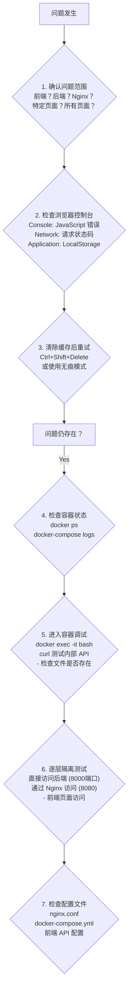

<div align="right"> <a href="/posts/fronted-backend_integrated_deploy">English</a> | <a href="/posts/前后端集成部署"><strong>简体中文</strong></a> </div>

## 集成部署模拟

### PC模拟树莓派

​	在 PC 上使用 Docker Compose 完整地模拟出树莓派上的所有服务（Nginx + FastAPI + Astro静态文件），在部署前发现并修复大量配置问题（比如 Nginx 代理路径写错、CORS 策略问题等），极大地提高了部署的成功率。

### 核心理念：用 Docker Compose 编排一个“迷你互联网”

在 PC 上，用一个 docker-compose.yml 文件来定义和启动三个相互关联的服务，模拟真实部署场景：

1. **nginx 服务 (Web 服务器/反向代理)**: 

   ​	这是唯一的“守门人”。所有来自浏览器的请求都先发给它。它负责将静态内容（ Astro 网站）直接返回，并将 API 请求（/api/...）转发给后端。

2. **backend 服务 (FastAPI 应用)**: 

   ​	它躲在 Nginx 后面，从不直接与外界对话。它只接收来自 Nginx 转发过来的 API 请求，并执行业务逻辑（操作 Markdown 文件）。

3. **Astro 的构建产物 (dist/ 目录)**: 

   ​	这不是一个“服务”，而是一个被 Nginx 服务使用的“数据卷”。

Docker Compose 会为这些服务创建一个隔离的内部网络，让它们可以通过服务名（如 http://backend:8000）相互通信。

### TODO：搭建本地模拟环境

#### 第一步：调整项目结构，集中管理

为了方便 Docker Compose 管理所有部分，把配置文件放在项目根目录。

```
/webTest/
├── backend/
│   ├── app/
│   ├── Dockerfile
│   └──docker-compose.yml <-- 后端的dokcer配置,和上一级目录无关
├── yukina/
│   ├── src/
│   └── ... ( Astro 项目)
│
├── nginx/                     <-- Nginx 配置文件夹
│   ├── nginx.conf             # Nginx 配置文件
│   └── Dockerfile             # 用于构建 Nginx 镜像
│
└── docker-compose.yml         <-- 唯一的、总的编排文件
```

#### 第二步：创建 Nginx 的配置文件

1. 在项目根目录创建 nginx 文件夹。

2. 在 nginx/ 文件夹内，创建 nginx.conf 文件。这是模拟环境的灵魂。

3. 在 nginx/ 文件夹内，创建 Dockerfile。这个文件非常简单，只是为了把我们的配置文件复制到官方 Nginx 镜像里。

   ```Dockerfile
   # nginx/Dockerfile
   
   # 使用官方 Nginx 镜像
   FROM nginx:stable-alpine
   
   # 删除默认的 Nginx 配置
   RUN rm /etc/nginx/conf.d/default.conf
   
   # 将我们自己写的配置文件复制到容器内
   COPY nginx.conf /etc/nginx/conf.d/
   ```

#### 第三步：编写总的 docker-compose.yml

在 **项目根目录** (/webTest/) 创建 docker-compose.yml 文件。

```yml
version: '3.8'

services:
  # 后端 FastAPI 服务
  backend:
    # 指定构建上下文和 Dockerfile 的位置
    build:
      context: ./backend
      dockerfile: Dockerfile
    container_name: sim_backend
    # 卷挂载：
    # - 挂载代码以支持热重载 (仅用于开发验证)
    # - 挂载数据目录以持久化 SQLite 数据库
    # - 关键：挂载前端内容目录，让后端可以操作 Markdown 文件
    volumes:
      - ./backend/app:/code/app
      - ./backend/data:/code/data
      - ./fronted/src/contents:/code/fronted/src/contents # 路径可能需要调整
    # 注意：不再需要 ports 映射，因为它不直接对外暴露

  # 前端 Nginx 服务
  nginx:
    build:
      context: ./nginx
      dockerfile: Dockerfile
    container_name: sim_nginx
    # 端口映射：将 PC 的 8080 端口映射到 Nginx 容器的 80 端口
    ports:
      - "8080:80"
    # 卷挂载：
    # - 将 PC 上构建好的 Astro dist 目录，挂载到 Nginx 的网站根目录
    volumes:
      - ./yukina/dist:/usr/share/nginx/html
    # 依赖关系：确保 backend 服务先启动，Nginx 才启动
    depends_on:
      - backend
```

**注意：** 

​	在 backend 服务的 volumes 中，需要添加一行来挂载前端的 content 目录，这样 FastAPI 才能找到并修改 Markdown 文件。同时，FastAPI 代码中对该目录的路径引用也需要正确配置。

#### 第四步：执行完整的模拟工作流

现在，可以开始模拟了。

1. **构建前端**:
   - 首先，必须先构建出静态网站。
   - cd 进入 frontend 目录，运行 pnpm run build。
   - 确保 frontend/dist/ 文件夹已生成。
2. **启动整个模拟环境**:
   - 回到项目**根目录** (/webTest/)。
   - 运行命令：docker-compose up --build
   - Docker Compose 将会：
     - 为 backend 和 nginx 分别构建镜像。
     - 创建一个内部网络。
     - 按 depends_on 的顺序，先启动 backend 容器，再启动 nginx 容器。
     - 挂载所有定义的 volumes。
3. **验证模拟结果**:
   - **验证前端**: 打开浏览器，访问 http://localhost:8080 (注意，是 8080端口)。你应该能看到Astro 博客网站首页。点击链接，浏览不同页面，确认网站可以正常访问。
   - **验证后端 API 文档**: 访问 http://localhost:8080/docs。这个请求会被 Nginx 捕获，然后转发给 backend 服务。如果能看到 FastAPI 的 Swagger UI 界面，说明反向代理**成功**
4. **进行端到端测试**:
   1. 访问管理员登录页面 (例如 http://localhost/admin/login)。
   2. 尝试登录。这个登录请求会经过 Nginx -> backend。
   3. 登录成功后，尝试新建、编辑或删除一篇文章。
   4. **关键验证**: 当你保存一篇文章后，后端的 trigger_astro_rebuild() 函数会被调用。**在模拟环境中，这一步会失败**，因为容器内通常没有 Node.js 环境。**但这是预料之中的** 模拟环境的主要目的是验证**API的连通性和Nginx的配置**。
   5. 可以手动停止服务 (Ctrl+C)，重新执行第一步 (pnpm run build)，再重新启动服务 (docker-compose up)，然后刷新浏览器，应该能看到刚刚新建或修改的文章。

​	这个流程在 PC 上拥有了一个与树莓派部署时**网络架构完全一致**的环境，从而可以自信地进行开发和测试。

### 总结

​	**现在所处的状态，正是从“验证网络连通性”迈向“实现完整自动化工作流”的完美过渡点。**

之前的模拟环境，其核心目的是证明：

1. 浏览器可以和 Nginx 对话。
2. Nginx 可以正确地提供静态文件。
3. Nginx 可以正确地将 API 请求转发给 FastAPI。

这个目的**已经圆满达成**。现在，我们要让这个环境变得**真正可用**，解决那个预料之中的失败。

------


## 集成部署环境开发总结 - Bug 修复方案

### 一、项目背景与目标

#### 1.1 项目概述

​	本项目旨在通过 Docker Compose 在 PC 上模拟树莓派 4B 的生产环境，构建一个完整的博客系统集成部署架构。系统采用三层架构：

- **Nginx**：反向代理服务器，负责静态文件服务和 API 请求转发
- **FastAPI Backend**：后端 API 服务，处理博客文章的 CRUD 操作
- **Astro Frontend**：静态站点生成器，提供前端页面和管理员面板

#### 1.2 部署目标

1. 实现 Docker 容器化部署
2. 验证 Nginx 反向代理配置正确性
3. 测试管理员面板的完整 CRUD 功能
4. 确保前后端通过 Nginx 正常通信

### 二、Docker 构建上下文问题

#### 2.1 问题描述

**错误信息：**

```bash
failed to calculate checksum of ref: "/yukina/package.json": not found
```

**问题根源：**

- 初始配置中，docker-compose.yml 的 build context 设置为 ./backend
- backend/Dockerfile 中尝试使用 COPY ../yukina/package.json 访问父目录
- Docker 构建上下文限制：无法访问 context 目录之外的文件

**代码示例（错误配置）：**

```Dockerfile
# backend/Dockerfile
COPY ../yukina/package.json /code/yukina/package.json  # ❌ 无法访问上级目录
```

#### 2.2 解决方案：双 Dockerfile 架构

采用方案二：**职责分离架构**

**架构设计**:

```bash
/webTest/
├── backend/
│   ├── app/
│   ├── Dockerfile          # 简化版：仅 Python + Node.js 环境
│   ├── docker-compose.yml  # 后端独立开发用
│   └── requirements.txt
├── yukina/                 # 前端项目
│   ├── package.json
│   └── pnpm-lock.yaml
├── nginx/
│   ├── Dockerfile
│   └── nginx.conf
├── backend.Dockerfile      # 完整版：包含所有依赖
└── docker-compose.yml      # 集成部署用（根目录）
```

**关键配置修改：**

1. **根目录 docker-compose.yml**

   ```yaml
   services:
     backend:
       build:
         context: .              # ✅ 构建上下文改为根目录
         dockerfile: backend.Dockerfile
       container_name: sim_backend
       command: uvicorn app.main:app --host 0.0.0.0 --port 8000 --reload
   ```

2. backend.Dockerfile（完整版）

   ```dockerfile
   FROM python:3.11-slim-bookworm
   
   # 安装系统依赖
   RUN apt-get update && apt-get install -y curl git && rm -rf /var/lib/apt/lists/*
   
   # 安装 Node.js 和 pnpm
   ENV NODE_VERSION=22
   RUN curl -fsSL https://deb.nodesource.com/setup_${NODE_VERSION}.x | bash - \
       && apt-get install -y nodejs
   RUN npm config set registry https://registry.npmmirror.com && npm install -g pnpm
   
   WORKDIR /code
   
   # 复制后端依赖
   COPY backend/requirements.txt /code/requirements.txt
   RUN pip install --no-cache-dir --upgrade -r /code/requirements.txt
   
   # 复制后端代码
   COPY backend/app /code/app
   
   RUN mkdir -p /code/yukina
   COPY yukina/package.json /code/yukina/package.json
   COPY yukina/pnpm-lock.yaml /code/yukina/pnpm-lock.yaml
   
   # 在构建时安装前端依赖
   RUN cd /code/yukina && pnpm install --frozen-lockfile
   
   EXPOSE 8000
   CMD ["uvicorn", "app.main:app", "--host", "0.0.0.0", "--port", "8000"]
   ```

3. **backend/Dockerfile（简化版）**

   ```dockerfile
   FROM python:3.11-slim-bookworm
   
   # 只安装 Python 和 Node.js 环境，不处理 pnpm 依赖
   RUN apt-get update && apt-get install -y curl git && rm -rf /var/lib/apt/lists/*
   
   ENV NODE_VERSION=22
   RUN curl -fsSL https://deb.nodesource.com/setup_${NODE_VERSION}.x | bash - \
       && apt-get install -y nodejs
   RUN npm config set registry https://registry.npmmirror.com && npm install -g pnpm
   
   WORKDIR /code
   RUN pip config set global.index-url https://pypi.tuna.tsinghua.edu.cn/simple
   
   COPY ./requirements.txt /code/requirements.txt
   RUN pip install --no-cache-dir --upgrade -r /code/requirements.txt
   
   COPY ./app /code/app
   
   # 创建前端项目目录（依赖通过 volume 挂载，在启动时安装）
   RUN mkdir -p /code/yukina
   
   EXPOSE 8000
   CMD ["uvicorn", "app.main:app", "--host", "0.0.0.0", "--port", "8000"]
   ```

   #### 2.3 方案优势

   1. **场景隔离**：独立开发和集成测试环境完全分离
   2. **职责清晰**：每个 Dockerfile 用途明确
   3. **无上下文问题**：完整版 Dockerfile 的上下文是根目录，可访问所有文件
   4. **利用缓存**：前端依赖在构建时安装，利用 Docker 层缓存

### 三、Node.js 依赖兼容性问题

### 3.1 问题描述

容器内执行 pnpm run build 失败，提示找不到 node_modules 或依赖不兼容。

**问题根源：**

- docker-compose.yml 挂载了整个 ./yukina 目录
- Windows 主机的 node_modules（Windows 平台编译的二进制）被挂载到 Linux 容器
- Linux 容器无法使用 Windows 平台的 node_modules

**代码示例（问题配置）：**

```yml
volumes:
  - ./yukina:/code/yukina  # ❌ 会覆盖容器内的 Linux 版本 node_modules
```

#### 3.2 解决方案：匿名卷保护

使用 Docker **匿名卷 (Anonymous Volume)** 保护容器内的 node_modules。

**修改后的 docker-compose.yml**：

```yml
services:
  backend:
    volumes:
      - ./backend/app:/code/app
      - ./backend/data:/code/data
      - ./yukina:/code/yukina              # 挂载前端项目
      - /code/yukina/node_modules          # 匿名卷：防止主机覆盖容器的 node_modules
    environment:
      - ASTRO_CONTENT_PATH=/code/yukina/src/contents/posts
      - ASTRO_PROJECT_PATH=/code/yukina
```

#### 3.3 技术原理

- 匿名卷优先级高于 bind mount
- 当两个卷挂载路径存在父子关系时，子路径（更具体的路径）优先
- /code/yukina/node_modules 匿名卷会覆盖来自 ./yukina:/code/yukina 的 node_modules

### 四、前端硬编码 URL 问题

#### 4.1 问题描述

前端 JavaScript 代码中硬编码了 http://localhost:8000，导致在集成环境（端口 8080）中无法访问 API。

**错误表现：**

- 浏览器控制台：ERR_CONNECTION_REFUSED
- 原因：前端尝试直接访问后端的 8000 端口，但该端口未对外暴露

#### 4.2 解决方案：使用相对路径

修改前端代码，使用相对路径，让所有 API 请求通过 Nginx 代理。

**修改文件清单：**

1. **apiClient.ts**

   ```ts
   class ApiClient {
     // ✅ 使用空字符串，所有请求使用相对路径
     private baseURL = import.meta.env.PUBLIC_API_URL || '';
   
     private async request<T = any>(endpoint: string, options: RequestInit = {}): Promise<T> {
       const url = `${this.baseURL}${endpoint}`;  // 例如：/api/admin/posts
       // ... 请求逻辑
     }
   }
   ```

2. **authService.ts**

   ```ts
   async login(credentials: LoginCredentials): Promise<boolean> {
     const response = await fetch('/token', {  // ✅ 相对路径
       method: 'POST',
       body: formData,
     });
     // ...
   }
   ```

3. **yukina.config.ts**

   ```ts
   const YukinaConfig: Configuration = {
     site: process.env.SITE_URL || "http://localhost:8080",  // ✅ 支持环境变量
     // ...
   };
   ```

#### 4.3 CORS 配置

后端添加 8080 端口到 CORS 白名单：

```py
# backend/app/core/config.py
ALLOWED_ORIGINS: list[str] = (
    ["http://localhost:3000", "http://127.0.0.1:3000",
     "http://localhost:8080", "http://127.0.0.1:8080"] +  # ✅ 添加 8080
    [f"http://localhost:{port}" for port in range(4321, 5001)] +
    [f"http://127.0.0.1:{port}" for port in range(4321, 5001)]
)
```

#### 4.4 构建和部署 

修改代码后需要重新构建前端：

```bash
cd yukina
pnpm install
pnpm run build
```

### 五、Nginx 反向代理重定向问题

#### 5.1 问题描述

**错误表现：**

- 浏览器请求：http://localhost:8080/api/admin/posts/（带斜杠）
- 服务器返回：307 Temporary Redirect
- 重定向位置：location: http://localhost/api/admin/posts（丢失端口 8080）
- 浏览器尝试访问：http://localhost:80/api/admin/posts → ERR_CONNECTION_REFUSED

**问题根源分析：**

1. FastAPI 自动重定向行为

   ```bash
   # 测试后端直接访问
   $ docker exec sim_backend curl -i http://localhost:8000/api/admin/posts/
   HTTP/1.1 307 Temporary Redirect
   location: http://localhost:8000/api/admin/posts
   ```

   - FastAPI 会将带斜杠的 URL 重定向到不带斜杠的版本

2. Nginx 未修正 location 头

   - 后端返回：location: http://localhost:8000/api/admin/posts
   - 通过 Nginx 代理后，浏览器收到：location: http://localhost/api/admin/posts
   - 端口号丢失！

#### 5.2 解决方案：Nginx 正则表达式重定向修正

**初始配置（无效）：**

```nginx
location ~ ^/(api|docs|openapi\.json|token) {
    proxy_pass http://backend:8000;
    proxy_redirect off;  # ❌ 完全禁用重定向修正
}
```

**尝试 1（无效）：**

```nginx
proxy_redirect http://backend:8000/ http://$host:$server_port/;
```

- $server_port 是容器内部端口（80），不是外部映射端口（8080）

**尝试 2（无效）：**

```nginx
proxy_redirect http://backend:8000/ http://$host:8080/;
```

**最终方案（有效）：使用正则表达式**

```nginx
location ~ ^/(api|docs|openapi\.json|token) {
    proxy_pass http://backend:8000;

    proxy_set_header Host $host;
    proxy_set_header X-Real-IP $remote_addr;
    proxy_set_header X-Forwarded-For $proxy_add_x_forwarded_for;
    proxy_set_header X-Forwarded-Proto $scheme;

    # ✅ 使用正则表达式捕获路径部分，重新构造 URL
    proxy_redirect ~^http://[^/]+(/.*)$ http://$host:8080$1;
}
```

**正则解释：**

- ```
  ~^http://[^/]+(/.*)$：匹配任意 HTTP URL，捕获路径部分
     [^/]+：匹配主机名和端口（非斜杠字符）
     (/.*)$：捕获完整路径（从第一个斜杠开始）
  http://$host:8080$1：重新构造为正确的 URL
     $host：当前主机名（localhost）
     8080：外部映射端口
     $1：捕获的路径部分
  ```

**验证结果：**

```bash
$ curl -i http://localhost:8080/api/admin/posts/
HTTP/1.1 307 Temporary Redirect
location: http://localhost:8080/api/admin/posts  # ✅ 端口正确
```

#### 5.3 完整 Nginx 配置

```nginx
# nginx/nginx.conf

server {
    listen 80;
    server_name localhost;

    # 禁用绝对路径重定向
    absolute_redirect off;
    # 禁止在重定向中添加端口号（避免端口混淆）
    port_in_redirect off;

    root /usr/share/nginx/html;
    index index.html;

    # 静态文件路由
    location / {
        try_files $uri $uri/ /index.html;
    }

    # API 反向代理
    location ~ ^/(api|docs|openapi\.json|token) {
        proxy_pass http://backend:8000;

        proxy_set_header Host $host;
        proxy_set_header X-Real-IP $remote_addr;
        proxy_set_header X-Forwarded-For $proxy_add_x_forwarded_for;
        proxy_set_header X-Forwarded-Proto $scheme;

        # 修正后端返回的重定向 URL
        proxy_redirect ~^http://[^/]+(/.*)$ http://$host:8080$1;
    }
}。
```

### 六、前端 Slug 提取逻辑错误

#### 6.1 问题描述

**错误表现：**

- 点击任意文章的编辑按钮，进入编辑页面
- 页面显示空白表单（类似创建页面），但按钮显示 "Update Post"
- 浏览器控制台错误：Failed to load post: Failed to fetch
- 网络请求显示：GET http://localhost:8080/api/admin/posts/ (末尾有斜杠，无 slug)
- 点击 "Update Post" 按钮报错：405 Method Not Allowed

**期望行为：**

- 应该请求：GET http://localhost:8080/api/admin/posts/Build-Environment-Test
- 加载文章数据并填充表单

#### 6.2 问题根源分析

**URL 路径结构：**
访问 URL: http://localhost:8080/admin/editor/Build-Environment-Test/
                                                                                                                                                                              															↑ 末尾有斜杠

**原始代码逻辑：**

```js
// yukina/src/pages/admin/editor/[slug].astro (第 172-174 行)

// ❌ 错误的 slug 提取逻辑
const pathSegments = window.location.pathname.split('/');
const slug = pathSegments[pathSegments.length - 1];
  
```

**执行结果分析：**
window.location.pathname = "/admin/editor/Build-Environment-Test/"

pathSegments = pathname.split('/')
// 结果：['', 'admin', 'editor', 'Build-Environment-Test', '']
//                                                           ↑ 末尾的空字符串

slug = pathSegments[pathSegments.length - 1]
// 结果：slug = '' (空字符串！)

**问题链：**

1. Slug 提取为空字符串
2. 调用 postService.getPostBySlug('')
3. 构造 API 请求：/api/admin/posts/${slug} → /api/admin/posts/
4. FastAPI 将 /api/admin/posts/ 重定向到 /api/admin/posts（获取所有文章列表的端点）
5. 返回文章列表而不是单篇文章
6. 前端无法解析数据，显示空表单
7. 提交时使用 PUT 方法请求 /api/admin/posts → 405 错误（该端点不支持 PUT）

#### 6.3 解决方案

**修复后的代码：**

```js
// yukina/src/pages/admin/editor/[slug].astro (第 172-175 行)

// ✅ 正确的 slug 提取逻辑：过滤掉空字符串
const pathSegments = window.location.pathname.split('/').filter(s => s.length > 0);
const slug = pathSegments[pathSegments.length - 1];
  
```

**执行结果：**
window.location.pathname = "/admin/editor/Build-Environment-Test/"

pathSegments = pathname.split('/').filter(s => s.length > 0)
// 结果：['admin', 'editor', 'Build-Environment-Test']
//  	  ↑ 空字符串已被过滤

slug = pathSegments[pathSegments.length - 1]
// 结果：slug = 'Build-Environment-Test' ✅

**验证结果：**

- API 请求：GET http://localhost:8080/api/admin/posts/Build-Environment-Test ✅
- 服务器返回：200 OK，包含文章完整数据
- 表单正确填充文章内容
- 编辑功能正常工作

### 6.4 重新构建前端

修改代码后需要重新构建：

```bash
# 1. 在本地构建前端
cd yukina
pnpm run build

# 2. Nginx 容器会自动使用新的 dist/ 目录（通过 volume 挂载）
# docker-compose.yml 配置：
#   nginx:
#     volumes:
#       - ./yukina/dist:/usr/share/nginx/html

# 3. 清除浏览器缓存并测试
# Ctrl+Shift+Delete → 清除缓存的图片和文件
  
```

#### 6.5 适用范围

此问题影响所有带斜杠的动态路由页面。类似的 URL 处理场景都应该使用 .filter() 方法：

```js
// ✅ 推荐模式：处理动态路由参数
const segments = window.location.pathname.split('/').filter(s => s.length > 0);
const param = segments[segments.length - 1];

// 或者使用 slice 排除第一个和最后一个空元素
const segments = window.location.pathname.split('/').slice(1, -1);
  
```

**注意事项：**

- Astro 生成的静态路由通常包含 index.html，URL 末尾可能有或没有斜杠
- absolute_redirect off 配置确保 Nginx 不会自动添加或删除斜杠
- 前端代码应该能够处理两种情况

------


### 七、浏览器缓存干扰问题

#### 7.1 问题描述

在多次修复配置后，用户仍然遇到旧的错误：

- 修改了 Nginx 配置，重启容器后问题依旧
- 修改了前端代码，重新构建后仍然请求错误的 URL
- 浏览器显示旧的响应数据

#### 7.2 问题根源

**HTTP 缓存机制：**

1. **静态资源缓存**：浏览器缓存 JavaScript、CSS 文件
2. **重定向缓存**：浏览器缓存 301/307 重定向响应
3. **Service Worker**：可能缓存 API 请求

**问题表现：**

- 浏览器加载了旧版本的 JavaScript 文件（包含硬编码 URL）
- 浏览器记住了错误的重定向（http://localhost/api/admin/posts）
- 即使服务器已修复，浏览器仍使用缓存

#### 7.3 解决方案

**强制清除浏览器缓存：**

**1. Chrome/Edge 清除缓存**

- Ctrl+Shift+Delete
- → 选择"缓存的图片和文件"
- → 选择"时间范围：全部时间"
- → 点击"清除数据"
  **2. 硬性重新加载**
- Ctrl+Shift+R (Windows/Linux)
- Cmd+Shift+R (Mac)
  **3. 使用无痕模式测试**
- Ctrl+Shift+N (Chrome/Edge)
- Ctrl+Shift+P (Firefox)
  **4. 禁用缓存（开发者工具）**
- F12 → Network 标签页 → ✓ Disable cache

**前端构建缓存清理：**

```bash
# Astro 构建时会生成带 hash 的文件名，自动处理缓存
cd yukina
rm -rf dist/
pnpm run build
```

**Docker 容器缓存清理：**

```bash
# 如果怀疑容器内有缓存问题
docker-compose down
docker-compose up -d --build --force-recreate
  
```

#### 7.4 预防措施

**开发阶段：**

1. 始终开启"禁用缓存"（开发者工具）
2. 每次修改配置后清除浏览器缓存
3. 使用无痕模式验证修复

**生产部署：**

1. Astro 自动为静态资源生成带 hash 的文件名
   _astro/postService.BhPugt7n.js
                       ↑ 内容 hash，内容变化时自动更新

2. Nginx 添加合适的缓存头（可选）

   ```nginx
   location /_astro/ {
   expires 1y;
   add_header Cache-Control "public, immutable";
   }
   
   location /api/ {
   add_header Cache-Control "no-cache, no-store, must-revalidate";
   }
   ```

------


### 八、TypeScript 配置问题

#### 8.1 问题描述

在本地开发时，VS Code 报错：
找不到文件 "astro/tsconfigs/strict"

### 8.2 问题根源

tsconfig.json 配置：

```json
{
"extends": "astro/tsconfigs/strict",
"include": [".astro/types.d.ts", "**/*"],
"exclude": ["dist"]
}
```

- 配置继承自 astro/tsconfigs/strict
- 但本地 node_modules 中没有 Astro 依赖
- 可能是因为：
  a. node_modules 被删除或损坏
  b. Windows 路径长度限制导致部分文件未安装
  c. 权限问题

#### 8.3 解决方案

**重新安装依赖：**

```bash
cd yukina

# 如果遇到删除失败（Windows 路径长度限制）
# 使用 pnpm 强制重装
pnpm install --force

# 或者使用 rimraf 工具
npm install -g rimraf
rimraf node_modules
pnpm install
  
```

**验证安装：**

```bash
# 检查 Astro 是否正确安装
ls yukina/node_modules/astro/tsconfigs/
# 应该输出：base.json  strict.json  strictest.json
  
```

**VS Code 重新加载：**

1. 按 Ctrl+Shift+P
2. 输入 TypeScript: Restart TS Server
3. 回车

#### 8.4 Windows 路径长度问题

**常见错误：**

- EACCES: permission denied, open 'D:\...\node_modules\...\package.json'
- 无法删除项 ... 未能找到路径的一部分

**原因：**

- Windows 默认路径长度限制为 260 字符
- node_modules 嵌套深度过深，路径超过限制

**解决方案：**

**1. 启用长路径支持（Windows 10 1607+）**

```bash
# 以管理员身份运行 PowerShell
New-ItemProperty -Path "HKLM:\SYSTEM\CurrentControlSet\Control\FileSystem" `
-Name "LongPathsEnabled" -Value 1 -PropertyType DWORD -Force
```

**2. 使用 pnpm 的 shamefully-hoist**

```bash
pnpm install --shamefully-hoist
```

​	将依赖提升到顶层，减少嵌套深度
**3. 移动项目到较短路径**

- D:\Coding\Wrote_Codes\webTest\yukina\node_modules\...  # 长路径

  ​			↓

- C:\webTest\yukina\node_modules\...  # 短路径

------


### 九、完整测试与验证

#### 9.1 环境启动流程

```bash
# 1. 确保前端已构建
cd yukina
pnpm install
pnpm run build

# 2. 启动集成环境
cd ..
docker-compose up -d --build

# 3. 检查容器状态
docker ps
# 应该显示：
# - sim_backend (运行中)
# - sim_nginx (运行中)

# 4. 检查日志（可选）
docker-compose logs -f backend
docker-compose logs -f nginx
```

#### 9.2 功能测试清单

**基础功能测试：**

- 访问首页：`http://localhost:8080` → `200 OK`
- 访问文章页：`http://localhost:8080/posts/xxx` → `200 OK`
- 访问 API 文档：`http://localhost:8080/docs` → Swagger UI 正常显示

**管理员面板测试：**

1.  **登录功能**
    - 访问：`http://localhost:8080/admin/login`
    - 输入用户名和密码
    - 成功登录，跳转到 Dashboard
2.  **文章列表（Read）**
    - 访问：`http://localhost:8080/admin/dashboard`
    - 显示所有文章列表
    - 网络请求：`GET /api/admin/posts` → `200 OK`
3.  **编辑文章（Update）**
    - 点击任意文章的"Edit"按钮
    - 跳转到编辑页面，URL 形如：`/admin/editor/xxx/`
    - 网络请求：`GET /api/admin/posts/xxx` → `200 OK`
    - 表单正确填充文章数据
    - Monaco 编辑器显示文章内容
    - 修改内容后点击"Update Post"
    - 网络请求：`PUT /api/admin/posts/xxx` → `200 OK`
    - 成功后跳转回 Dashboard
    - 后端执行 `pnpm run build` 重新生成静态文件
4.  **创建文章（Create）**
    - 点击"New Post"按钮
    - 填写表单和内容
    - 点击"Create Post"
    - 网络请求：`POST /api/admin/posts` → `200 OK`
    - 成功创建并跳转
5.  **删除文章（Delete）**
    - 点击文章的"Delete"按钮
    - 确认删除
    - 网络请求：`DELETE /api/admin/posts/xxx` → `200 OK`
    - 文章从列表中移除

#### 9.3 网络请求验证

使用浏览器开发者工具：

1. 按 `F12` 打开开发者工具
2. 切换到"Network"标签页
3. 执行操作，观察网络请求

**正确的请求模式：**

1. **获取所有文章**

   GET [http://localhost:8080/api/admin/posts](https://www.google.com/url?sa=E&q=http%3A%2F%2Flocalhost%3A8080%2Fapi%2Fadmin%2Fposts)
   Status: 200 OK

2. **获取单篇文章**

   GET [http://localhost:8080/api/admin/posts/Build-Environment-Test](https://www.google.com/url?sa=E&q=http%3A%2F%2Flocalhost%3A8080%2Fapi%2Fadmin%2Fposts%2FBuild-Environment-Test)
   Status: 200 OK

3. **更新文章**

   PUT [http://localhost:8080/api/admin/posts/Build-Environment-Test](https://www.google.com/url?sa=E&q=http%3A%2F%2Flocalhost%3A8080%2Fapi%2Fadmin%2Fposts%2FBuild-Environment-Test)
   Status: 200 OK
   Content-Type: application/json

4. **创建文章**

   POST [http://localhost:8080/api/admin/posts](https://www.google.com/url?sa=E&q=http%3A%2F%2Flocalhost%3A8080%2Fapi%2Fadmin%2Fposts)
   Status: 200 OK

5. **删除文章**

   DELETE [http://localhost:8080/api/admin/posts/Build-Environment-Test](https://www.google.com/url?sa=E&q=http%3A%2F%2Flocalhost%3A8080%2Fapi%2Fadmin%2Fposts%2FBuild-Environment-Test)
   Status: 200 OK

**检查重定向（如果有）：**

```bash
# 带斜杠的请求应该被正确重定向
GET http://localhost:8080/api/admin/posts/
Status: 307 Temporary Redirect
Location: http://localhost:8080/api/admin/posts  ✅ 端口正确

# 浏览器自动跟随重定向
GET http://localhost:8080/api/admin/posts
Status: 200 OK
```

#### 9.4 性能观察

**已知延迟：**

- 编辑页面加载时间：约 10 秒
- 原因：
  a. 容器内 Node.js 模块加载
  b. Markdown 文件读取和解析
  c. Docker 网络通信延迟

**正常范围：**

- 对于管理面板，10 秒的加载时间是可以接受的
- 如果需要优化，可以考虑：
  - 添加后端缓存
  - 优化文件读取逻辑
  - 使用数据库存储而非文件系统

好的，这是您提供的最后一部分内容的完整 Markdown 格式输出。

------


### 十、总结与最佳实践

#### 10.1 问题汇总表

| 序号 | 问题类型    | 问题描述                          | 根本原因                      | 解决方案                    | 影响范围      |
| ---- | ----------- | --------------------------------- | ----------------------------- | --------------------------- | ------------- |
| 1    | Docker 构建 | 无法访问上级目录文件              | Build context 限制            | 双 Dockerfile 架构          | 构建阶段      |
| 2    | 依赖兼容性  | Windows node_modules 不兼容 Linux | 平台差异                      | 匿名卷保护                  | 运行时        |
| 3    | 前端配置    | 硬编码 localhost:8000             | 开发环境配置残留              | 相对路径 + 环境变量         | API 请求      |
| 4    | Nginx 代理  | 重定向丢失端口号                  | FastAPI 重定向 + Nginx 未修正 | 正则表达式 proxy_redirect   | 所有 API 请求 |
| 5    | 前端逻辑    | Slug 提取错误                     | 未过滤空字符串                | filter() 方法               | 编辑页面      |
| 6    | 浏览器缓存  | 加载旧版本文件                    | HTTP 缓存机制                 | 清除缓存                    | 开发/测试     |
| 7    | TypeScript  | 找不到 astro 配置                 | node_modules 未安装           | 重新安装依赖                | 开发环境      |
| 8    | Windows     | 路径长度限制                      | 260 字符限制                  | 启用长路径/shamefully-hoist | 本地开发      |

#### 10.2 技术难点分析

##### 10.2.1 最难解决的问题：Nginx 重定向

**难度系数：⭐⭐⭐⭐⭐**

**困难点：**

1. **问题隐蔽**：错误发生在 HTTP 重定向层，不是代码逻辑错误
2. **多层传递**：FastAPI → Nginx → Browser，每层都可能是问题源
3. **配置复杂**：尝试了多种 proxy_redirect 配置都无效
4. **文档稀缺**：Nginx 正则表达式重定向的文档和示例较少

**解决关键：**

- 理解 FastAPI 的自动重定向行为（trailing slash）
- 理解 Nginx proxy_redirect 的匹配规则（需要精确匹配或正则）
- 使用正则表达式捕获路径部分，动态重构 URL

**经验教训：**

```nginx
# 错误：假设 $server_port 是外部端口
proxy_redirect http://backend:8000/ http://$host:$server_port/;

# 错误：尾部斜杠无法匹配不带斜杠的 location
proxy_redirect http://localhost:8000/ http://$host:8080/;

# 正确：使用正则表达式，匹配任意形式的 URL
proxy_redirect ~^http://[^/]+(/.*)$ http://$host:8080$1;
  
```

##### 10.2.2 容易忽略的问题：浏览器缓存

**难度系数：⭐⭐⭐**

**困难点：**

- 修改了服务器配置，但浏览器仍显示旧行为
- 容易误认为服务器配置未生效
- 浪费大量时间重复检查服务器配置

**预防措施：**

1. 开发时始终开启"禁用缓存"
2. 每次重大修改后清除浏览器缓存
3. 使用无痕模式验证修复效果
4. 观察 Network 标签中的请求来源（from cache / from network）

##### 10.2.3 平台差异问题：Windows vs Linux

**难度系数：⭐⭐⭐⭐**

**困难点：**

- Windows 主机 + Linux 容器的环境差异
- Node.js 原生模块（如 sharp）依赖平台编译
- Windows 路径长度限制
- 文件权限问题

**解决策略：**

- 使用 Docker 匿名卷隔离平台相关文件
- 在 Dockerfile 中安装依赖（而非启动时）
- 项目路径尽量简短
- 使用 pnpm 而非 npm（更好的 symlink 处理）

#### 10.3 最佳实践建议

##### 10.3.1 Docker 配置

**1. 构建上下文设计**

```yml
# ✅ 推荐：根目录作为 context，指定 dockerfile
services:
  backend:
    build:
      context: .                    # 根目录
      dockerfile: backend.Dockerfile # 指定文件

# ❌ 避免：子目录作为 context，访问父目录
services:
  backend:
    build:
      context: ./backend
      dockerfile: Dockerfile
    # 无法 COPY ../yukina/...
  
```

**2. 依赖管理策略**

```yml
# ✅ 推荐：构建时安装依赖
COPY package.json pnpm-lock.yaml ./
RUN pnpm install --frozen-lockfile
# ✅ 配合匿名卷保护
#  ============================ 上面是 powershell
# docker-compose.yml
volumes:
  - ./app:/app
  - /app/node_modules  # 匿名卷
  
```

**3. 多阶段构建（优化）**

```dockerfile
# 可选：如果镜像体积是关注点
FROM node:22-alpine AS frontend-builder
WORKDIR /build
COPY yukina/package.json yukina/pnpm-lock.yaml ./
RUN pnpm install
COPY yukina/ ./
RUN pnpm run build

FROM python:3.11-slim
WORKDIR /app
COPY --from=frontend-builder /build/dist /app/frontend
# ... 其余配置
  
```

##### 10.3.2 Nginx 配置

**1. 反向代理最佳实践**

```nginx
    location /api/ {
    # 基础代理
    proxy_pass http://backend:8000;

    # 必需的请求头
    proxy_set_header Host $host;
    proxy_set_header X-Real-IP $remote_addr;
    proxy_set_header X-Forwarded-For $proxy_add_x_forwarded_for;
    proxy_set_header X-Forwarded-Proto $scheme;

    # 修正重定向（根据实际需求）
    proxy_redirect ~^http://[^/]+(/.*)$ http://$host:$server_port$1;

    # 超时设置（长时间操作）
    proxy_connect_timeout 60s;
    proxy_send_timeout 60s;
    proxy_read_timeout 60s;
}
  
```

**2. 静态文件服务**

```nginx
    location / {
    root /usr/share/nginx/html;
    try_files $uri $uri/ /index.html;  # SPA 路由支持

    # 缓存策略
    location ~* \.(jpg|jpeg|png|gif|ico|css|js|woff2?)$ {
        expires 1y;
        add_header Cache-Control "public, immutable";
    }
}
  
```

**3. 重定向控制**

```nginx
server {
# 禁用绝对路径重定向（避免端口问题）
absolute_redirect off;

# 禁止添加端口号
port_in_redirect off;

# 统一 trailing slash 处理
# 选择 A：强制添加斜杠
rewrite ^([^.]*[^/])$ $1/ permanent;

# 选择 B：强制移除斜杠
rewrite ^/(.*)/$ /$1 permanent;
} 
```

##### 10.3.3 前端配置

**1. API 基础路径配置**

~~~ts
// ✅ 推荐：使用环境变量 + 相对路径
class ApiClient {
  private baseURL = import.meta.env.PUBLIC_API_URL || '';

  async request(endpoint: string) {
    const url = `${this.baseURL}${endpoint}`;
    // baseURL 为空时，endpoint 必须以 / 开头（相对路径）
    // baseURL 有值时，使用完整 URL（开发环境）
  }
}
``````ini
# .env.development
PUBLIC_API_URL=http://localhost:8000

# .env.production
PUBLIC_API_URL=  # 留空，使用相对路径
  
~~~

**2. URL 参数提取**

```ts
// ✅ 推荐：过滤空字符串
const segments = window.location.pathname
  .split('/')
  .filter(s => s.length > 0);
const slug = segments[segments.length - 1];

// ❌ 避免：直接使用 split 结果
const segments = window.location.pathname.split('/');
const slug = segments[segments.length - 1];  // 可能是空字符串
  
```

**3. 错误处理**

```ts
// ✅ 推荐：详细的错误信息
try {
  const response = await fetch(url);
  if (!response.ok) {
    throw new Error(`HTTP ${response.status}: ${response.statusText}`);
  }
  return await response.json();
} catch (error) {
  console.error('API request failed:', {
    url,
    error: error.message,
    stack: error.stack
  });
  throw error;
}
  
```

##### 10.3.4 开发调试

**1. 日志记录**

```dockerfile
# Docker 容器日志
docker-compose logs -f backend
docker-compose logs -f nginx

# 进入容器调试
docker exec -it sim_backend bash
docker exec -it sim_nginx sh

# 查看 Nginx 配置
docker exec sim_nginx cat /etc/nginx/conf.d/nginx.conf

# 测试容器内网络
docker exec sim_backend curl -i http://backend:8000/api/admin/posts
  
```

**2. 网络请求调试**

```js
// 浏览器控制台：查看实际请求
window.addEventListener('fetch', (event) => {
  console.log('Fetch request:', event.request.url);
});

// 或者在代码中添加日志
async request(endpoint: string) {
  const url = `${this.baseURL}${endpoint}`;
  console.log('API Request:', {
    endpoint,
    fullUrl: url,
    baseURL: this.baseURL
  });
  // ... 请求逻辑
}
  
```

**3. 缓存控制**

```
# 开发时禁用浏览器缓存
# F12 → Network → ✓ Disable cache

# 清除 Docker 构建缓存
docker-compose build --no-cache

# 清除前端构建缓存
rm -rf yukina/dist/
rm -rf yukina/.astro/
pnpm run build
  
```

#### 10.4 部署检查清单

**部署前：**

- 所有硬编码的 URL 已替换为环境变量或相对路径
- 前端代码已构建：pnpm run build
- Docker 镜像已构建：docker-compose build
- .env 文件配置正确
- docker-compose.yml 中的端口映射正确

**部署后：**

- 容器状态检查：docker ps
- 日志检查：docker-compose logs
- 基础访问测试：首页、API 文档
- 管理员面板登录测试
- CRUD 功能完整测试
- 网络请求验证（F12 → Network）
- 性能测试：响应时间、资源加载

**生产环境额外检查：**

- HTTPS 配置（Let's Encrypt / Certbot）
- 防火墙规则
- 备份策略
- 监控和日志收集
- 资源限制（CPU、内存）
- 自动重启策略

#### 10.5 故障排查流程图

```
graph TD
    A["问题发生"] --> B{"1. 确认问题范围 <br/> - 前端？后端？Nginx？ <br/> - 特定页面？所有页面？"};
    B --> C{"2. 检查浏览器控制台 <br/> - Console: JavaScript 错误 <br/> - Network: 请求状态码 <br/> - Application: LocalStorage"};
    C --> D{"3. 清除缓存后重试 <br/> - Ctrl+Shift+Delete <br/> - 或使用无痕模式"};
    D --> E["问题仍存在？"];
    E -- Yes --> F{"4. 检查容器状态 <br/> - docker ps <br/> - docker-compose logs"};
    F --> G{"5. 进入容器调试 <br/> - docker exec -it bash <br/> - curl 测试内部 API <br/> - 检查文件是否存在"};
    G --> H{"6. 逐层隔离测试 <br/> - 直接访问后端 (8000端口) <br/> - 通过 Nginx 访问 (8080) <br/> - 前端页面访问"};
    H --> I{"7. 检查配置文件 <br/> - nginx.conf <br/> - docker-compose.yml <br/> - 前端 API 配置"};
```




#### 10.6 经验总结

**成功经验**

1. **分层架构设计**
   - 独立开发环境与集成环境分离
   - 各司其职，互不干扰
   - 便于维护和扩展
2. **问题定位方法**
   - 从浏览器到容器，逐层排查
   - 使用 curl 测试内部网络
   - 观察完整的 HTTP 请求/响应周期
3. **配置管理**
   - 使用环境变量管理不同环境配置
   - 相对路径而非硬编码 URL
   - 详细的注释说明
4. **版本控制**
   - 及时提交工作代码
   - 详细的 commit message
   - 必要时创建分支测试

**避免的陷阱**

1. **假设默认行为**
   - Nginx 的 $server_port 不是外部端口
   - FastAPI 会自动重定向 trailing slash
   - 浏览器会缓存重定向响应
2. **忽视平台差异**
   - Windows 与 Linux 的路径分隔符
   - Windows 路径长度限制
   - 原生模块的平台依赖
3. **过度优化**
   - 不必过早引入复杂的缓存策略
   - 10秒的管理面板响应时间可以接受
   - 先确保功能正确，再考虑性能
4. **配置不一致**
   - 开发环境和生产环境配置要同步
   - 前后端的端口配置要一致
   - 文档要及时更新

#### 10.7 未来改进方向

**短期改进（1-2周）**

1. **添加自动化测试**

   ```
   # 健康检查脚本
   #!/bin/bash
   echo "Testing frontend..."
   curl -f http://localhost:8080 || exit 1
   
   echo "Testing API..."
   curl -f http://localhost:8080/docs || exit 1
   
   echo "All tests passed!"
     
   ```

2. **优化构建速度**

   - 使用 Docker 层缓存
   - 分离依赖安装和代码复制
   - 考虑使用 BuildKit

3. **添加健康检查**

   ```
   services:
   backend:
   healthcheck:
     test: ["CMD", "curl", "-f", "http://localhost:8000/docs"]
     interval: 30s
     timeout: 10s
     retries: 3
     
   ```

**中期改进（1-2个月）**

1. **CI/CD 集成**
   - GitHub Actions 自动构建
   - 自动化测试
   - 自动部署到测试环境
2. **监控和日志**
   - 集成 Prometheus + Grafana
   - ELK 日志收集
   - 错误追踪（Sentry）
3. **性能优化**
   - Redis 缓存热点数据
   - CDN 加速静态资源
   - 数据库索引优化

**长期改进（3-6个月）**

1. **微服务化**
   - 文章服务独立
   - 用户服务独立
   - API Gateway
2. **高可用架构**
   - 负载均衡
   - 数据库主从复制
   - 容器编排（Kubernetes）
3. **开发体验提升**
   - Dev Container 配置
   - 自动化脚本工具
   - 完善的开发文档

------

---------------------------开玩笑，包当鸽子的 (bushi)---------------------------------

------


### 十一、附录：快速参考

#### 11.1 常用命令速查

```bash
# ========== Docker 操作 ==========
# 启动环境
docker-compose up -d

# 重新构建并启动
docker-compose up -d --build

# 停止环境
docker-compose down

# 查看日志
docker-compose logs -f [service_name]

# 进入容器
docker exec -it sim_backend bash
docker exec -it sim_nginx sh

# 重启服务
docker-compose restart [service_name]

# ========== 前端操作 ==========
# 安装依赖
cd yukina
pnpm install

# 开发模式
pnpm run dev

# 构建生产版本
pnpm run build

# 清理缓存
rm -rf dist/ .astro/ node_modules/

# ========== 调试命令 ==========
# 测试 Nginx 代理
curl -i http://localhost:8080/api/admin/posts

# 测试后端直接访问
docker exec sim_backend curl -i http://localhost:8000/api/admin/posts

# 查看 Nginx 配置
docker exec sim_nginx cat /etc/nginx/conf.d/nginx.conf

# 查看容器状态
docker ps
docker stats

# ========== Git 操作 ==========
# 查看状态
git status

# 提交更改
git add .
git commit -m "fix: 修复 Nginx 重定向问题"

# 创建分支测试
git checkout -b feature/test-integration
  
```

#### 11.2 配置文件模板

**docker-compose.yml（完整版）：**

```yml
    # 博客集成部署环境配置
services:
  backend:
    build:
      context: .
      dockerfile: backend.Dockerfile
    container_name: sim_backend
    command: uvicorn app.main:app --host 0.0.0.0 --port 8000 --reload
    volumes:
      - ./backend/app:/code/app
      - ./backend/data:/code/data
      - ./yukina:/code/yukina
      - /code/yukina/node_modules  # 匿名卷保护
    environment:
      - ENVIRONMENT=production
      - ASTRO_CONTENT_PATH=/code/yukina/src/contents/posts
      - ASTRO_PROJECT_PATH=/code/yukina
    # 不对外暴露端口，只通过 nginx 访问

  nginx:
    build:
      context: ./nginx
      dockerfile: Dockerfile
    container_name: sim_nginx
    ports:
      - "8080:80"
    volumes:
      - ./yukina/dist:/usr/share/nginx/html
    depends_on:
      - backend

networks:
  default:
    name: blog_network
  
```

**nginx.conf（完整版）：**

```nginx
    server {
    listen 80;
    server_name localhost;

    absolute_redirect off;
    port_in_redirect off;

    root /usr/share/nginx/html;
    index index.html;

    location / {
        try_files $uri $uri/ /index.html;
    }

    location ~ ^/(api|docs|openapi\.json|token) {
        proxy_pass http://backend:8000;

        proxy_set_header Host $host;
        proxy_set_header X-Real-IP $remote_addr;
        proxy_set_header X-Forwarded-For $proxy_add_x_forwarded_for;
        proxy_set_header X-Forwarded-Proto $scheme;

        proxy_redirect ~^http://[^/]+(/.*)$ http://$host:8080$1;
    }
}
  
```

#### 11.3 故障代码速查表

| HTTP 状态码 | 含义       | 常见原因               | 解决方法            |
| ----------- | ---------- | ---------------------- | ------------------- |
| 200         | 成功       | -                      | -                   |
| 307         | 临时重定向 | FastAPI trailing slash | 检查 proxy_redirect |
| 401         | 未认证     | JWT token 缺失/过期    | 重新登录            |
| 404         | 未找到     | URL 错误 / 文件不存在  | 检查路由配置        |
| 405         | 方法不允许 | HTTP 方法错误          | 检查 API 端点定义   |
| 500         | 服务器错误 | 后端代码异常           | 查看后端日志        |
| 502         | 网关错误   | 后端服务未启动         | 检查容器状态        |
| 504         | 网关超时   | 后端响应慢             | 增加超时设置        |

**浏览器错误代码：**

| 错误代码                   | 含义         | 解决方法           |
| :------------------------- | :----------- | :----------------- |
| ERR_CONNECTION_REFUSED     | 连接被拒绝   | 检查端口、清除缓存 |
| ERR_NAME_NOT_RESOLVED      | DNS 解析失败 | 检查域名配置       |
| ERR_CERT_AUTHORITY_INVALID | 证书无效     | HTTPS 配置问题     |

#### 11.4 关键文件路径

**项目根目录**：D:\Coding\Wrote_Codes\webTest\

**配置文件：**

```
├── docker-compose.yml          # 集成环境配置
├── backend.Dockerfile          # 后端完整版镜像
├── backend/
│   ├── Dockerfile              # 后端简化版镜像
│   ├── docker-compose.yml      # 后端独立开发配置
│   └── app/
│       ├── main.py
│       ├── api/posts.py        # 文章 API 路由
│       └── core/config.py      # CORS 配置
├── nginx/
│   ├── Dockerfile
│   └── nginx.conf              # Nginx 配置
└── yukina/
    ├── yukina.config.ts        # Astro 站点配置
    ├── src/
    │   ├── services/
    │   │   ├── apiClient.ts    # API 客户端
    │   │   ├── authService.ts  # 认证服务
    │   │   └── postService.ts  # 文章服务
    │   └── pages/admin/editor/
    │       └── [slug].astro    # 编辑页面（slug 提取）
    └── dist/                   # 构建产物（挂载到 Nginx）
  
```

------


### 十二、完成标志与验收标准

#### 12.1 功能验收标准

**基础功能（必须全部通过）：**

- [✅] Docker 环境成功启动，无错误日志
- [✅] 访问 http://localhost:8080 显示博客首页
- [✅] 访问 http://localhost:8080/docs 显示 API 文档
- [✅] 管理员登录功能正常
- [✅] 文章列表正常显示
- [✅] 编辑功能：能加载文章内容并保存
- [✅] 创建功能：能创建新文章
- [✅] 删除功能：能删除文章

**网络请求（必须符合预期）：**

- [✅] API 请求通过 Nginx 代理（8080 端口）
- [✅] 重定向包含正确的端口号
- [✅] 无 CORS 错误
- [✅] 无 ERR_CONNECTION_REFUSED 错误

**性能指标（参考值）：**

- 首页加载：< 3 秒
- API 请求响应：< 2 秒
- 编辑页面加载：< 12 秒（可接受）

#### 12.2 问题解决确认

**所有已知问题已修复：**

1. [✅] Docker 构建上下文问题 → 双 Dockerfile 架构
2. [✅] Node.js 依赖兼容问题 → 匿名卷保护
3. [✅] 前端硬编码 URL → 相对路径
4. [✅] Nginx 重定向端口丢失 → 正则表达式修正
5. [✅] Slug 提取逻辑错误 → filter() 过滤空字符串
6. [✅] 浏览器缓存干扰 → 清除缓存流程
7. [✅] TypeScript 配置问题 → 重新安装依赖

#### 12.3 文档完整性

**已交付文档：**

- [✅] Bug 修复总结
- [✅] 问题描述、根源分析、解决方案
- [✅] 最佳实践建议
- [✅] 快速参考手册
- [✅] 故障排查流程

**配置文件：**

- [✅] docker-compose.yml（完整配置）
- [✅] backend.Dockerfile（完整版）
- [✅] backend/Dockerfile（简化版）
- [✅] nginx.conf（包含重定向修正）

#### 12.4 项目交付清单

- [✅] 代码仓库（含所有配置文件）
- [✅] Bug 修复总结文档（本文档）
- [☐] 部署脚本
- [☐] 测试用例清单
- [✅] 环境变量说明
- [✅] 端口映射文档
- [✅] 故障排查指南
- [☐] 性能测试报告（可选）

### 结语

​	本次集成部署环境的开发和调试过程，涵盖了从 Docker 容器化、Nginx 反向代理、到前端 API 集成的完整技术栈。我们遇到了 8 个主要问题，通过系统化的排查和分析，逐一找到了根本原因并实施了有效的解决方案。

**核心收获：**

1. **分层排查**：从浏览器到容器，逐层定位问题
2. **理解原理**：深入理解 HTTP 重定向、Docker 构建上下文、浏览器缓存等机制
3. **最佳实践**：建立了可复用的配置模板和开发流程

**技术亮点：**

- 双 Dockerfile 架构实现职责分离
- 匿名卷解决跨平台依赖问题
- Nginx 正则表达式动态修正重定向
- 前端相对路径实现环境无关配置

​	这份文档不仅记录了问题解决过程，更沉淀了可复用的经验和最佳实践，为后续的项目开发和部署提供了宝贵的参考。

**项目状态： ✅ 集成部署环境测试完成，所有功能正常运行**

------


- **文档版本**： v1.0
- **完成时间**： 2025-10-01-3:46
- **开发者**： Juyao Huang
- **项目**： 博客系统集成部署环境


